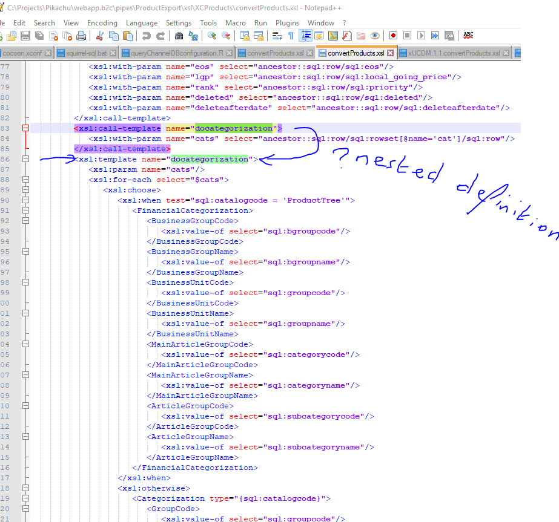

```{r setup, include=FALSE}
library(tidyverse)
library(kableExtra)
```


## Introduction

The Pikachu product-exports have been analysed with regards to 

  - configuration (both parameters and country-assignment),
  - modifications based on custom code,
  - validity of the output against the xUCDM schema,
  - other exceptions and observations,
  - (customised) content of the product exports.

### execution of the analysis

The analysis is partially manual and partially automated and can therefore be (partially) reproduced automatically when new versions of the code become available. All results are included in this report and on several tabs of the accompanying spreadsheet.


### layout of the report

This report starts out with the conclusions and recommendations, followed by the details of the different topics.


## Conclusions

  1. code-base (Subversion) contains in-active exports that can be removed,
  2. code-base can be simplified by removing unnecessary copies of stylesheets,
  3. Pikachu export channels contain exports that don't produce any output, because of
    - invalid code (FuturesourceProducts),
    - empty catalogs (MMDProductExport, SPAF (for some locales), VmaHK).
  4. Pikachu export channels produce invalid exports, because of
    - invalid content (text strings that are longer than defined in the xUCDM model),
    - incorrect order of content,
    - missing mandatory information,
    - additional un-defined content.
  5. only three main versions of xUCDM:  
    - xUCDM 1.1.2 (majority),
    - xUCDM B2B 1.2 (Leaflet),
    - xUCDM CQ 1.1.3 (almost xUCDM 1.4),  
    and one exception:  
    - xUCDM 1.4 (EloquaProducts),
  6. xUCDM CQ 1.1.3 is based on xUCDM v1.3, but identical to v1.4 with the only difference that the element 'CSItemDescription' is included in the final result). So xUCDM CQ 1.1.3 ~= xUCDM 1.4 (see also the Notes in the paragraph 'Channel product-metadata content' ).
  7. no obvious issues with locale-settings (except possibly for bullet no. 3b wrt 'empty catalogs'.)


## Recommendations

  1. clean-up unnessesary code (for inactive channels and duplicated code and exports that are not missed by anyone),
  2. create valid xUCDM content (correct export templates),
  3. reduce product content to one xUCDM version (base format on majority format; either on 1.1.2 or CQ 1.1.3)
  4. re-introduce xUCDM level parameter for defining the scope of the content.
  5. base the product metadata exports on metadata xUCDM v1.4 (the differnces with 1.3 seem very minor).
  99. if the xsl-transformations are re-used, remove all the commented code and apply a proper indenting based on spaces instead of a combination of tabs and spaces.


## Results


### xUCDM validity

See spreadsheet "SyndicationChannels_consolidated.xlsx" tab ["PCHU Channel validity"](SyndicationChannels_consolidated.xlsx#'PCHU Channel validity'!A18).

<!-- 
Note: creating a link (from Markdown) to a tab in an Excel spreadsheet is described at https://stackoverflow.com/questions/5807556/excel-hyperlink-to-different-workbook-and-specific-worksheet
-->

*Valid* channel content:

  - Bazaarvoice
  - ChinaProducts
  - EStoreProducts
  - FlixMediaProducts
  - LirioProducts
  - PILProducts2Hybris
  - Products2CQ
  - Products2CQLighting


*InValid* channel content:

  - AutomotiveProductsExport
  - ChannelAdvisor
  - ChinaShopProducts
  - CliplisterProducts
  - EirtightProducts
  - EloquaProducts
  - eShop
  - EtailDetailProducts
  - ETLProducts
  - FlixMediaProducts
  - FoxIntProducts
  - FuturesourceProducts
  - HomeLightMetadata
  - ICEcat
  - MMDProductExport
  - MyShopProducts
  - PhilipsRetailDirect
  - PILProductsMetadata2Hybris
  - ProductDescription
  - ProductsMetadata2CQ
  - ProductsMetadata2CQLighting
  - SearchStream
  - Tradeplace
  - WebcollageProducts
  - XCProducts

channel content that can't be validated (because no XML Schema exists):

  - ProductDescription
  - SPAF
  - VmaHK


Note: 

  - the validation errors are mentioned (in a non-technical way) in the spreadsheet,
  - most invalid channel exports can be made valid by either relieving the length constraint on the ‘BrandedFeatureString’ or by reducing the length of the content for this field.


### Channel parameters

See spreadsheet "SyndicationChannels_consolidated.xlsx" tab "[PCHU Channel Parameters](SyndicationChannels_consolidated.xlsx#'Channel_Parameters'!A1)".

Observations:

  - sometimes parameters are defined that are ignored because a custom "convertProducts" transformation is used.
  - broker-level is sometimes set. Is it used?
  Eg "Tradeplace"-export (broker-level = 2) should contain far less content than eStoreProducts  (broker-level = 5). Most probably this is only reflected in the included assets (see asset configuration),
  - zip-parameter seems to be important to include in future implementations,
  - secureURL-parameter seems to be important to include in future implementations.


### Channel locale-configuration

See spreadsheet "SyndicationChannels_consolidated.xlsx" tab ["PCHU Channel Locales"](SyndicationChannels_consolidated.xlsx#'PCHU_Channel_Locales'!A1).

Observations:

  - what is the difference between 'Bazaarvoice' and 'Bazaarvoice Global'?
  - are all locales still valid?


### Channel asset-configuration

See spreadsheet "SyndicationChannels_consolidated.xlsx" tab ["Assets"](SyndicationChannels_consolidated.xlsx#'Assets'!A1).

Observations:

  - none.


### Channel product content

The channel content is divided into the following categories:

  1. exports that use *default* xUCDM v1.1.2 (without channel exceptions):  
    - ChannelAdvisor
    - ChinaProducts
    - ChinaShopProducts
    - CliplisterProducts
    - EirtightProducts
    - eShop
    - EStoreProducts
    - FoxIntProducts
    - FuturesourceProducts
    - ICEcat
    - LirioProducts
    - MyShopProducts
    - PhilipsRetailDirect
    - SearchStream
    - Tradeplace

  
  2. exports that use *customisations* of xUCDM v1.1.2 (with channel exceptions):  
    - AutomotiveProductsExport
    - EtailDetailProducts
    - ETLProducts
    - FlixMediaProducts
    - IceCatRichContent (RichText feed)
    - MMDProductExport (RichText feed identical to IceCatRichContent)
    - WebcollageProducts (1.1.2 without RichText-elements)
    - XCProducts


  3. exports that use *customisations* of xUCDM v1.4 (with channel exceptions):  
    - EloquaProducts

  4. exports that use *customisations* of xUCDM B2B v1.2 (with channel exceptions):  
    - LDRenderingExport

  5. exports that use *customisations* of xUCDM CQ 1.1.3 (with channel exceptions):  
    - PILProducts2Hybris
    - Products2CQ
    - Products2CQLighting

  6. non-xUCDM channels (*full customisations*)
    a. Bazaarvoice (Bazaarvoice_global): based on Bazaarvoice v14.7,
    b. ProductDescription (custom),
    c. ShopBazaarvoice (custom),
    d. SPAF (custom),
    e. VmaHK (custom).

The channels with a custom-mapping are described in detail on the tab ["Product content"](SyndicationChannels_consolidated.xlsx#'Product_content'!A1) in the spreadsheet "SyndicationChannels_consolidated.xlsx".


### Channel product-metadata content

See spreadsheet "SyndicationChannels_consolidated.xlsx" tab ["Product content"](SyndicationChannels_consolidated.xlsx#'Product_content'!A1).

There are the following categories:

  1. metadata xUCDM v1.3 (with channel exceptions):  
    a. HomeLightMetadata

  2. metadata xUCDM v1.4 (with channel exceptions):  
    a. PILProductsMetadata2Hybris
    b. ProductsMetadata2CQ 
    c. ProductsMetadata2CQLighting

*Note*

  - there is no product meta-data export that uses the default "metadata xUCDM" V1.3 or v1.4 templates.
  - differences between v1.3 and v1.4 is the import of 'common/xsl/xucdm-product-external-v1.3.xsl' vs 'common/xsl/xucdm-product-external-v1.4.xsl'
  - differences between 'common/xsl/xucdm-product-external-v1.3.xsl' vs 'common/xsl/xucdm-product-external-v1.4.xsl' is the way that the NamingString-element is created (in both versions the Range-element is excluded).


#### HomeLightMetadata (metadata v1.3)

In v1.3 some attributes (gtin, locale) are either always populated, or can remain empty.


#### PILProductsMetadata2Hybris (metadata v1.4)

  - no support for secureURL-parameter
  - stylesheets ('xUCDM.1.4.convertProducts.xsl' and 'convertProducts.xsl') are completely different.
  - queries product data including visibility/clearance settings,
  - adds visibility/clearance elements to the Catalog-element (***defined in xUCDM???***),


#### ProductsMetadata2CQ (metadata v1.4)

In v1.4  
  - a test on availability of some attributes (gtin, locale, division) is included,
  - FilterGroup values are queried/stored differently and conditionally included,
  - global and local Catalog is populated differently,
  - Catalog-rank is populated differently,

Differences between ProductsMetadata2CQ and PILProductsMetadata2Hybris are

  - different product selection (sql_getlocaleproducts.xsl) resulting in different sql-elements that are removed,
  - also contains 'care'-products (PCT in 'sql_selectproducts.xsl'),
  


#### ProductsMetadata2CQLighting (metadata v1.4)

  - ProductsMetadata2CQLighting uses the same 'convertProducts.xsl' as ProductsMetadata2CQ.
  - product selection (sql_select\*.xsl/sql_get\*.xsl) differs and includes additional selection on  localized_subcat groupcode='LIGHTING_GR'.


#### Rare content

##### ReviewStatistics

Are included in the (active) feeds:

  - Eloqua Products
  - PILProducts2Hybris
  - Products2CQ
  - Products2CQLighting


##### AssetServiceManuals

Are included in the feeds:

  - XCProducts


##### Product 'ID'

Are included in the feeds:

  - BazaarVoice ('custom export')
  - XCProducts ('xUCDM')


### Product selection

Apart from the customisations with respect to the content of the exported product data, many exports also apply different selection criteria for the products that are included into the export.

These differences have not (yet) been analyzed.


### In-active exports that clutter the code

The code for the following channels can be removed from the Pikachu code-base:

  - AtgGifting
  - AtgPCTProducts
  - AtgProducts
  - BrightcoveManifest
  - ChannelIntelligence
  - EtailDetailProductCR
  - Products2Hybris
  - ProductsCare2CQ
  - ProductsMetadata2Hybris
  - SaecoBazaarvoice
  - ShopAtgSearch
  - VCProducts


### Active FTP-interfaces


#### SIM-tool processes

active export | process | errors | files sent | remarks
------------- | ------- | ------ | ------- | ---------------------------- 
yes | alatest-to-pikachu | no | yes | Complex job uploaded 1 file.
yes | B2B-Hybris-meta_upload-ACC | no | yes |  
yes | bazaarvoice | no | yes |  | 
yes | ChannelAdvisor_si_SI | ? | no | transferred 0 files: 40 times before. Files don't seem to be processed on remote server. *Note*: One month old files can be found.
yes | CliplisterProducts | no | no | pikachu-to-clipster transferred 0 files: 1 times before. *Note*: no old files can be found.
yes | CliplisterProducts2 | no | yes | 
yes | cq5-cat_PRX_Prod | no | ? | transferred 0 files: 1 times before.
yes | cq5-meta_PRX_Stg | no | ? | transferred 0 files: 1 times before.
yes | eloqua | no | no
yes | EtailDetailProducts | no | yes | 
yes | ETLsaving_Calcu | no | yes | archive_ftp/remote (unclear) directory contains files > 1 year old. No archiving/deletions?
?   | feedcommerce | no | yes |  *Note*: old zip- and xml-files found. No archiving/deletions?
yes | feedcommerce_PL_Eirtight | no | yes | *Note*: remote dir contains file 'Apr 19  2017 DO NOT USE THIS LOCATION.txt' and zip-files from this date onward...
yes | flixmedia | no | yes | 
yes | FlixMediaProducts_DE | no | ? | pikachu-to-flixmedia transferred 0 files: 1 times before. *Note*: One month old files can be found.
yes | Hybris | no | yes | 
yes | icecat | ? | ? | *Note*: remote dir contains 2 year old files. But also recent files.
yes | IceCatRichContent | yes | yes | Job completed: pikachu-to-IceCatRichContent with 1 errors (retry of ftp put-commend for failed transfer). *Note*: remote dir contains 2 year old files. But also recent files.
?   | infomatica_tradeplace | no | yes | 
?   | lightingaws | no | yes | 
yes | Lirio | no | yes | 
?   | meta-cat-file-copy | no | no | *Note*: cp: missing destination file operand after `/applusr/pals/sim/data/pikachu-to-B2B-Hybris-meta_upload'
yes | MMDProductExport | no | yes | 
yes | myshop1 | no | no | *Note*: ssh_exchange_identification: Connection closed by remote host. Couldn't read packet: Connection reset by peer.
yes | rendering | no | yes | 
yes | searchstream | no | yes | 
yes | spaf | no | ? | pikachu-to-spaf transferred 0 files: 4 times before. *Note*: recent files available.
yes | WebcollageProducts | no | ? | pikachu-to-webcollage transferred 0 files: 3 times before. *Note*: recent files available.


#### Missing FTP-processes for active exports

```{r data_count1, echo=FALSE, message=FALSE, paged.print=FALSE}
# 1. read active processes
activeExports <-
  readRDS(file = "../analyse/output/activeChannels.Rds")

# 2. filter out processes that are not listed in above table
activeExports %>%
  dplyr::filter(tolower(channel) %in% 
                    tolower(c("AmaHK", "AutomotiveProductsExport",
                               "ChinaProducts", "CockpitReportExport", "EStoreProducts", 
                               "FYP", "FoxIntProducts", "FuturesourceProducts", 
                               "HomeLightMetadata", "Netbiscuits", "PhilipsRetailDirect",
                               "ProductDescription", "Tradeplace", "VmaHK", "XCProducts"
                               ))) %>%
  kableExtra::kable(caption="Active exports without FTP process") %>%
  kableExtra::kable_styling()
```


### Code optimalisation

#### LDRenderingExport

The stylesheet that retrieves the product-content also queries the categorization tree (query with name='cat'). This information is not used for rendering and the query can therefore be removed. This will make the rendering export slightly faster (which can help because of the scale of rendering (=thousands of leaflets)).

#### XCProducts

The 'convertProducts.xsl' stylesheet contains nested templates. This is not permitted by the xsl standards.
Apparantly the xsl parser does not complain and this is working.

Example: 
the Product-template ```<xsl:template match="Product">``` contains the nested template ```<xsl:template name="docategorization">```.

