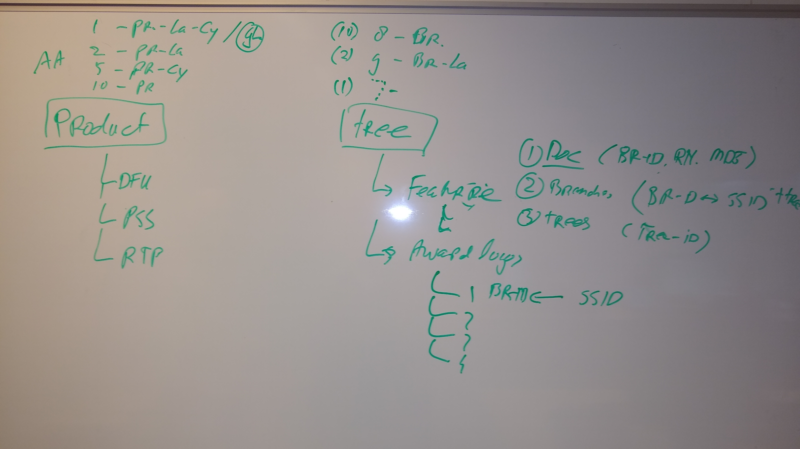

```{r setup, include=FALSE}
knitr::opts_chunk$set(echo = TRUE)

library(tidyverse)
library(kableExtra)
```

## Description

In the future the distinction between global and local awards is no longer made based on the asset type (award) and there will only be 1 asset type. This means that the current usage is to be analysed and an approach to migrate them into the new set up is needed.
This story is to verify the actual usage in PFS (KAx), CCR, Pikachu and AEM. The latter check can be done by checking PRX.

Especially the usage / dependency at AEM side on the use of KAx and Ala_award needs to be clear to be able to create stories for the AEM backlog.


## Acceptance criteria

Usage of award types clarified and based on clarification removed from migration scope if needed.


## Award types

source: CCR

| doc-type | description | format |
| -------- | ----------- | ------ |
| KA1 | Key award 1 child | TIF |
| KA2 | Key award 1 child | TIF |
| KA3 | Key award 1 child | TIF |
| KA5 | Key award 1 child | TIF |
| KA5 | Key award 1 child | TIF |
| KA6 | Key award 1 child | TIF |
| KA7 | Key award 1 child | TIF |
| KA8 | Key award 1 child | TIF |
| KA9 | Key award 1 child | TIF |
| AWP | Award Picture | JPG |
| GFA | Green Flagship Award  | PDF |
| AWL | Award source logo | TIF |
| AWR | Award rank | TIF |
| GAW | Global award logo | JPG |
| GAP | Global award logo - 2400x2400 | TIF |
| GAZ | Global award logo - rendering | PNG |


According to the story, the focus is on the **Ala_award** and **KAx Award**-types.


## CCR

The following applicaiton areas are defined in CCR:

| id       | description | applicable for |
| -------- | ----------- | ------ |
| 1  | pr-la-co | Product |
| 2  | pr-la | Product |
| 5  | pr-co | Product |
| 10 | pr | Product |
| 8 | br | Tree |
| 9 | br-la | Tree |

With 'pr'=product, 'la'=language, 'co'=country, 'br'=branch.

Doc-types are valid for a product or multiple branches.



When assets are uploaded, the branch is specified.

When an asset is related to a product in PFS, the branch or asset-id is used. A preview of the asset is presented in PFS.

Available information in CCR;

  1. Doc: branch-id, md5, resource-name
  2. Branch: branch-id, tree-id, ssid (id from Pikach)
  3. Tree: tree-id

This information can be exported and related to re-create the tree structure.


## Pikachu 

Pikachu 

  - receives new/updated assets from CCR,
  - sends the new/updated assets to Scene7 for publication,
  - CCR receives the url's from Scene7,
  - CCR sends the public url's to PFS *or* Pikachu(?),
  - processes the product-data, including asset-ids, from PFS,
  - exports this data to the different channels.

### Feeds with these awards

source: Pikachu Prod (2018-oct-22)

Based on a file-search (Grep) through the downloaded Pikachu feeds for all active channels,
the WebcollageProducts-feeds contain the most of the asset types mentioned in paragraph 'Award types'. Also the 'Ala_award' award type is included in this feed.

This feed looks like the best starting point for a more in-depth analysis.

The AWP-type is only present in the EloquaProducts-feed (EloquaProducts_Export_20181020T0720_RU_ru_RU.xml).

Exceptions (or not in my selection of exported data):
  - GAW: not found
  - AWR: not found


  
### Observations

  1. assets included in Webcollage global and local feed are exactly identical,
  2. Webcollage global and local feeds both contain both global and local assets,


The Key-Awards (as assets) are present as doctypes in the 

  1.AssetList:
    - KAx (public + secure + internal url)
    - KxP (secure + internal url)
  2. P4C_xSPOT_Marketing_Asset_201811261100_0001
    - KAx (X>3)


The Key-Awards (as awards) are present in the 

  1. PMT_Raw import (for product "BG105/10")

```
    <Award AwardType="global_highlight">
      <AwardCode>GA40019044</AwardCode>
      <AwardName>iF DESIGN AWARD 2016</AwardName>
      <AwardDate>2016</AwardDate>
      <AwardPlace>Germany</AwardPlace>
      <AwardDescription>BodyGroom 1000</AwardDescription>
      <AwardAcknowledgement>iF DESIGN AWARD 2016</AwardAcknowledgement>
      <AwardRank>1</AwardRank>
    </Award>
    <Award AwardType="global_highlight">
      <AwardCode>GA40019049</AwardCode>
      <AwardName>Red Dot Award 2016: Winner</AwardName>
      <AwardDate>2016</AwardDate>
      <AwardPlace>Germany</AwardPlace>
      <AwardDescription>BodyGroom 1000</AwardDescription>
      <AwardAcknowledgement>Red Dot Award 2016: Winner</AwardAcknowledgement>
      <AwardRank>2</AwardRank>
    </Award>
```
The relation between these Awards of type 'global highlight', which for this product corresponds to the KeyAward, and the acompanying image/asset is based on the AwardCode that is equal to the ObjectId in the ObjectAssetList. This object contains assets of type 'GAL', 'GAP', 'GAW' and 'GAZ'


### Awards in WebcollageProducts-feed

The Awards were extracted from the WebcollageProducts-feeds:

  - WebcollageProducts_ProductExport_20181022T0746_nl_NL.xml
  - WebcollageProducts_ProductExport_20181022T0746_zh_CN

Note: based on the first observation, only the local feeds were used.

The following data-set shows the 'raw' assets from the feeds.

```{r import_data, echo=FALSE}
###############################################################################
# read data
###############################################################################
load(file = "../data/awards/awards.RData")

glimpse(awards.r)
```

The unique mime-types present in the feed are:
```{r mime_type, echo=FALSE, message=FALSE}
unique(awards.c$extension)
```

The total number of awards is `r nrow(awards.r)`.

For which locales are the Awards defined?

```{r data_count2, echo=FALSE, message=FALSE}
###############################################################################
# query the data:
###############################################################################
# 1. how many locales per asset type?
awards.r %>%
  dplyr::group_by(type,locale) %>%
  dplyr::summarise() %>%
  kableExtra::kable(caption="Locales per asset-type") %>%
  kableExtra::kable_styling()

# # A tibble: 9 x 2
# # Groups:   type [?]
# type  locale
# <chr> <chr> 
# 1 GAP   global
# 2 KA1   nl_NL 
# 3 KA2   nl_NL 
# 4 KA3   nl_NL 
# 5 KA4   nl_NL 
# 6 KA5   nl_NL 
# 7 KA6   nl_NL 
# 8 KA7   nl_NL 
# 9 KA8   nl_NL
```


```{r data_count0, echo=FALSE, message=FALSE}
count_unique_id <-
  awards.r %>%
  dplyr::distinct(id, .keep_all = FALSE) %>%
  dplyr::tally()
```
The number of unique assets (based on ID) is `r count_unique_id`.

Note: the asset-id (from the Pikachu export) is *not* unique! It often contains a product-identifiyer (seeexample below). So using the id's from the export can be ignored.

```
      <Asset code="55OLED803_12" description="Front product photograph - highres 2196x1795" extension="tif" lastModified="2018-04-18" locale="global" number="001" type="_FP">http://images.philips.com/is/image/PhilipsConsumer/55OLED803_12-_FP-global-001</Asset>
      <Asset code="55OLED803_12" description="User manual" extension="pdf" lastModified="2018-10-09" locale="nl_NL" number="001" type="DFU">http://download.p4c.philips.com/files/5/55oled803_12/55oled803_12_dfu_nld.pdf</Asset>
      <Asset code="55OLED803_12" description="Key award 1" extension="tif" lastModified="2018-09-10" locale="nl_NL" number="001" type="KA1">http://images.philips.com/is/image/PhilipsConsumer/55OLED803_12-KA1-nl_NL-001</Asset>
      <Asset code="55OLED803_12" description="Key Award 2 " extension="tif" lastModified="2018-09-10" locale="nl_NL" number="001" type="KA2">http://images.philips.com/is/image/PhilipsConsumer/55OLED803_12-KA2-nl_NL-001</Asset>
      <Asset code="55OLED803_12" description="Key Award 3" extension="tif" lastModified="2018-09-10" locale="nl_NL" number="001" type="KA3">http://images.philips.com/is/image/PhilipsConsumer/55OLED803_12-KA3-nl_NL-001</Asset>
etc...
```

The number of occurances of each unique asset (based on url) is shown in the following table (note: the top-most 15 rows are shown).
```{r data_count1, echo=FALSE, message=FALSE}
# 2. how many unique assets (based on ID) and how many occurances of each asset?
awards.r %>%
  dplyr::group_by(url) %>%
  dplyr::summarise(asset.count = n()) %>%
  dplyr::arrange(desc(asset.count)) %>%
  dplyr::top_n(5) %>%
  kableExtra::kable(caption="Most frequently occuring assets grouped by url") %>%
  kableExtra::kable_styling()
```

So only the GAP asset is reused. All other assets seem to be unique for the product. Based on grouping on the url, there are `r nrow(awards.c)` unique assets. Note that the product-id is included in the url.

Based on knowledge of CCR/PFS/Pikachu, we know that when the asset is published, a unique url is created for each published product asset.
The number of unique assets is expected to be far lower.

Next, for each of the unique url's the image is downloaded and the md5-checksum for this image is calculated. The structure of this data-set looks as follows:
```{r data_count4, echo=FALSE, message=FALSE}
count_unique_md5 <-
  awards.c %>%
  dplyr::distinct(md5, .keep_all = FALSE) %>%
  dplyr::tally()

glimpse(awards.c)
```

The number of unique assets based on the md5-checksum is `r count_unique_md5` (so down from a total of `r nrow(awards.r)`).

The **conclusion** is that:

  1. assets are not reused, but created anew,
  2. some identical assets are published with a new url,
  

How many unique assets (based on checksum) per asset-type?
```{r data_count5, echo=FALSE, message=FALSE}
awards.c %>%
  dplyr::distinct(md5, .keep_all = TRUE) %>%
  dplyr::group_by(type) %>%
  dplyr::summarise(count = n()) %>%
  dplyr::arrange(desc(count)) %>%
  dplyr::top_n(15) %>%
  kableExtra::kable(caption="Unique assets per asset-type") %>%
  kableExtra::kable_styling()

# # A tibble: 9 x 2
# type  count
# <chr> <int>
# 1 GAP      21
# 2 KA1      34
# 3 KA2      11
# 4 KA3       7
# 5 KA4       3
# 6 KA5       1
# 7 KA6       1
# 8 KA7       1
# 9 KA8       1
#
# total: 80 assets
```

What are the most often (re)occuring assets?
```{r data_count6, echo=FALSE, message=FALSE}
awards.c %>%
  dplyr::group_by(md5, type) %>%
  dplyr::summarise(count = n()) %>%
  dplyr::arrange(desc(count)) %>%
  dplyr::filter(count > 1) %>%
  dplyr::top_n(15) %>%
  kableExtra::kable(caption="Most frequently occuring assets grouped by MD5-checksum") %>%
  kableExtra::kable_styling()
```

The asset with md5="b2a3816bd00372242ae6151723c0b613" is used as both KA1 and KA2.
This reuse is present for other assets aswell.

```{r data_count6b, echo=FALSE, message=FALSE}
# # A tibble: 68 x 2
# md5                              asset.count
# <chr>                                  <int>
# 1 ba3eabb4e22523d8e90cef4533a3905b          13
# 2 a62e920776efa6eaca73d2d9e8ef76b5          11
# 3 37ca4e43cfdcd7ac2d28ea596867ad03           8
# 4 5d521b959dd6d11bf0d29ea4a87ee27b           6
# 5 90ac01e97a7488432c4223d185c8963c           6
# 6 a86863a30b8dbe82baddd10672a3af46           5
# 7 acb2c460e0a0fdaf6210bb3e8d3a6c6e           5
# 8 c67daf75b586757c6e632ec9fdfd6cc7           5
# 9 496543d5b5cbce0f2cf4c301ed7a6183           4
# 10 b2a3816bd00372242ae6151723c0b613           4
# # ... with 58 more rows

# --> sommige assets worden onder twee asset-typen opgevoerd!
#   voorbeeld: asset met md5="ba3eabb4e22523d8e90cef4533a3905b"

awards.c %>%
  dplyr::filter(md5 == "ba3eabb4e22523d8e90cef4533a3905b") %>%
  dplyr::select(-md5) %>%
  kableExtra::kable(caption="Occurences of the asset with md5='ba3eabb4e22523d8e90cef4533a3905b'") %>%
  kableExtra::kable_styling()
```

**Conclusions**: this asset is 

  - used as both a 'GAP' and as a 'KA4' asset type,
  - created *and* published anew for different products


### Pikachu Imports

KAx awards are present in the 


### Conclusions (based on Pikachu data)

```{r data_count9, echo=TRUE, message=FALSE}
# Sanity check
(awards.summary <-
  awards.c %>%
  summarise(unique.id.count = n_distinct(id),
            unique.url.count = n_distinct(url),
            unique.md5.count = n_distinct(md5),
            unique.prd.count = n_distinct(parent_id)))
```
Looks like chaos...

There are two scenarios resulting in the increase of award assets;

  1. desired: the same asset is  
    * published once to scene7, 
    * reused and related to multiple products.
  2. unwanted: for the same image, a new asset is created one or more times in CCR. The individual assets are  
    * related to multiple products,
    * published separately to Scene7, resulting in unique urls that provide the same image.

Based on filtering-out the unique assets based on the image md5-checksum, while retaining the relations from those assets to the products, a fairly reduced set of assets/awards in STEP is possible. The reduction, based on the current dataset containg `r nrow(awards.r)` assets, can be approximately `r round((100-100*awards.summary$unique.md5.count/nrow(awards.r)), 0)` %.

Possible approach:

  1. gather awards/assets from all full feeds,  
     possibly only use the most important feeds to save time.
  2. calculate the md5-checksum for all these assets,
  3. group by md5-checksum, retaining the references to the products for which these assets where assigned,
  4. upload the assets to the new asset repository,
    * using the new asset-type 'Award',
    * including related products,
  
Possible improvements:

  - only retain awards/assets that are newer than yyyy-mm-dd.

Questions:

  1. are the asset caption texts required?
  2. how are the assets related to the awards in STEP?
  3. do we/can we create the award-product relations in STEP?
    note; this information is available!

Note that based on this migration-approach, the assets will be based on the published images, not on the master-images of these assets.
A better approach is to base the migration on the master-images available in CCR. This requires 

  - either a backtracking of published assets to the sources in CCR,
  - a migration approach based on the Pikachu (object-)asset feed.

Note that the asset-list contains the product-assets, the object-asset-list contains object (eg feature) related assets.

The object-asset-list (data: 27-11-2018) contains approx. 5868 Object-elements that contain one of the GAx asset-types, but no KAi asset-types.
The KAi asset-types can be found in the AssetList import files. The InternalResourceIdentifier contains the URI to the master image (TIF-file).

*Issue:*
Both the AssetList and ObjectAssetList only contain the MD5-checksum (and the doc-type) to identify the asset.
