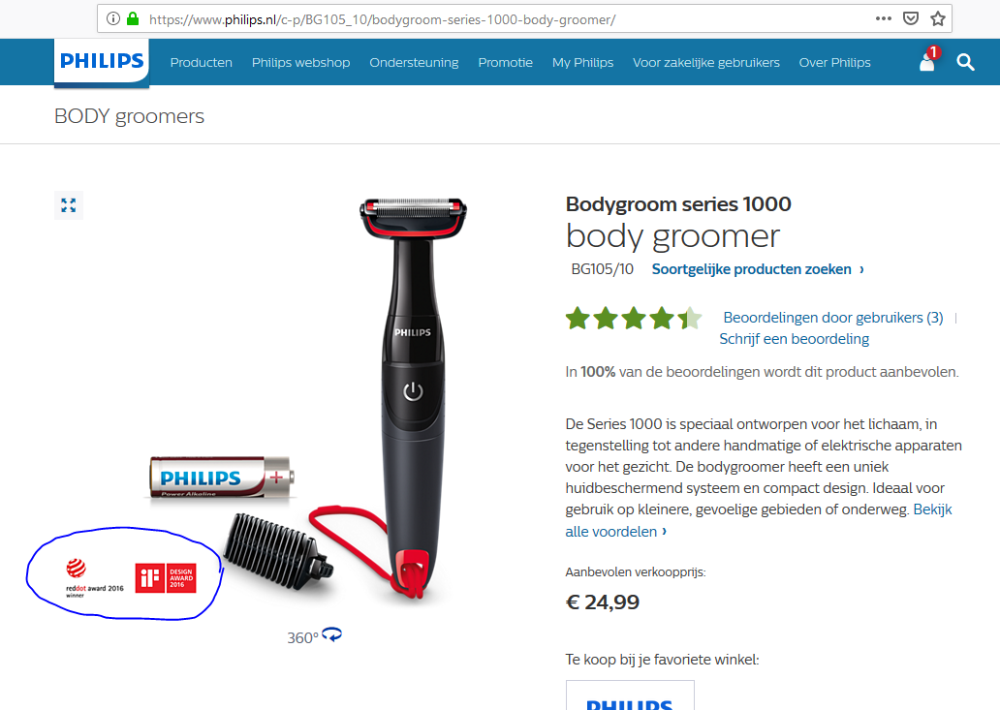
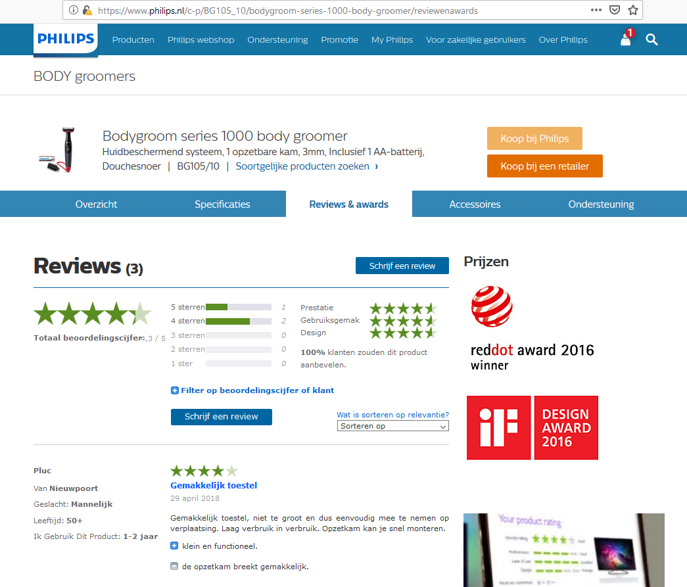

```{r setup, include=FALSE}
knitr::opts_chunk$set(echo = TRUE)

library(tidyverse)
library(kableExtra)
```


## Description

In the future the distinction between global and local awards is no longer made based on the asset type (award) and there will only be 1 asset type. This means that the current usage is to be analysed and an approach to migrate them into the new set up is needed.
This story is to verify the actual usage in PFS, CCR, Pikachu and AEM. The latter check can be done by checking PRX.

Especially the usage / dependency at AEM side on the use of Key-Awards and Ala_award needs to be clear to be able to create stories for the AEM backlog.


## Acceptance criteria

Usage of award types clarified and based on clarification removed from migration scope if needed.


## Results


### Alatest awards

The "Ala_award" is exported from Pikachu to AEM and imported into PRX, but not published on the AEM website.

This award type can therefore be ignored in the migration.


### Key-Awards

The Key-Awards ("KAx", with x=[1..9]. are used on the AEM website and need to be migrated. The Key-Awards are shown on both the product-detail-page, in the corners of the product-beauty-shot image, and on the product-reviews page.

 


Key-Awards are locale-specific.


#### Pikachu

The Key-Awards are included in the product message as Asset-elements in the AssetList-element.

Eg. the "red-dot award"-image is included as
```
      <Asset>
        <ResourceType>KA1</ResourceType>
        <Language>nl_NL</Language>
        <PublicResourceIdentifier>http://download.p4c.philips.com/files/b/bg105_10/bg105_10_ka1_nldnl.tif</PublicResourceIdentifier>
        <Format>image/tiff</Format>
        <Md5>28ebe7b76712f9ffebc42c87f68c6f06</Md5>
        <Caption/>
      </Asset>
```
*Note*: 

  1. irrelevant information has been removed from the presented code.
  2. the public url for all the `KxP` type assets is empty.


The Key-Awards are, for the products checked in more detail, *also modelled* as an Award-element with `AwardType="global_highlight"` in the Pikachu "PMT_Raw" up to PMT" content-types
```
    <Award AwardType="global_highlight">
      <AwardCode>GA40019049</AwardCode>
      <AwardName>Red Dot Award 2016: winnaar</AwardName>
      <AwardDate>2016</AwardDate>
      <AwardPlace>Duitsland</AwardPlace>
      <AwardDescription>BodyGroom 1000</AwardDescription>
      <AwardAcknowledgement>Red Dot Award 2016: winnaar</AwardAcknowledgement>
      <AwardRank>2</AwardRank>
    </Award>
```

*Note*: 

  1. the "PMT_Raw" content-type is the initial content-type in Pikachu, received from the application PFS,
  1. the "PMT" content-type is the final content-type in Pikachu and is used as source for the different exports,
  2. the other Award-elements are created for the "Alatest"-awards, which are no longer presented on AEM, but still present in the Pikachu database.

The image that corresponds to the Award is stored in the ObjectAssetList-element as an Object with one or more assets.
```
      <Object>
        <id>GA40019049</id>
        <Asset>...</Asset>
        ...
      </Object>
```
The relation between these Awards of type 'global highlight', which for this product corresponds to the KeyAward, and the acompanying image/asset is based on the AwardCode that is equal to the ObjectId in the ObjectAssetList. This object contains assets of type 'GAL', 'GAP', 'GAW' and 'GAZ'


Finally, these Key-Awards are also included as assets of type 'KxP' (x = 1..9). These assets only have the internal and secure url.


#### PRX/AEM

In PRX, awards are created for the Key-Awards and other Awards in the Pikachu feed.

The awards data-model in PRX includes the following attributes for the Key-Awards:

  1. awardType ("KAx", with x=1..9),
  2. assets (1), with
    * url
    * type ("KAx", with x=1..9)

*Note*: other awards are modelled in PRX like

  1. awardCode,
  1. awardName,
  1. awardDate (in format 'YYYY'),
  1. awardPlace (aka country, like "Duitsland"),
  1. awardDescription (eg "BodyGroom 1000"),
  1. awardAcknowledgement (eg "Red Dot Award 2016: winnaar"),
  1. awardRank (in numeric format),
  1. awardType ("KAx", with x=1..9),
  2. assets (1), with
    * url
    * type ("KAx", with x=1..9)

*Note*: 

  1. based on these results, it looks like the PRX-loaders create the awards for the Key-Awards based on the Pikachu Assets with ResourceType="KAx". The other awards in PRX are based on the Pikachu Award-elements.  
  This conclusion is based on the ommision of all award-attributes in PRX that are not present in the Pikachu Asset-element, but are available in the Pikachu Award element.
  2. it also means that sufficient information is available in Pikachu to migrate all relevant Award information, including the description, into STEP.

*Source*: https://www.philips.co.uk/prx/product/B2C/nl_NL/CONSUMER/products/SW7700_67.awards


#### STEP

Awards are modelled as a separate object in STEP. An award can be related to a product.

Awards can have a title, description and an image.


### Migration approach

Based on the current setup in PFS, CCR and Pikachu, each award is exported to the website with the Product-data (ie. in the product message) and has a URL that is unique for the product. 
When the product-data is used as starting point for the migration, this results in two major issues:

  1. too many award assets will be migrated,
  2. the public url points to the low-res image, degrading the quality of the asset.

When the asset-urls are used to download the images and a md5-checksum is calculated, the number of unique images is found to be approx. `r round(100*68/142, digits = 0)`%.

The following criteria are defined for the starting point of the migration:

it must be possible 

  * to obtain the master image of the award (TIF-format),
  * to retrieve the unique images (based om MD5-checksum = no duplication of data),
  * to retrieve the locale (language+country) for which the award is applicable,
  * to link the award to the product (product id available),
  * to indicate that the award is a Key-Award.
  
One location where all required information is available is the AssetList-import in Pikachu. Because the Awardinformation in Pikachu does not contain a 'description' or 'caption', the asset-description in STEp can not be populated with this source.

Because the ObjectAssetList also contains the Key-Awards, this looks like the best source for migrating the awards.


#### Disadvantage(s)

  * re-use of the same award for a group of products (linking the asset to a higher level in the product-tree) is not possible with this approach,


#### ToDo

  * *open question*: should the award caption be migrated?  
    --> answer: not available for a award in Pikachu,
  * describe data-model of awards in STEP in detail,
  * describe upload mechanism to ADAM and/or STEP. This should cover:
    * linking assets to awards,
    * linking awards to products/levels in blue-tree,
    * marking the award-product-relation as 'KeyAward'.


