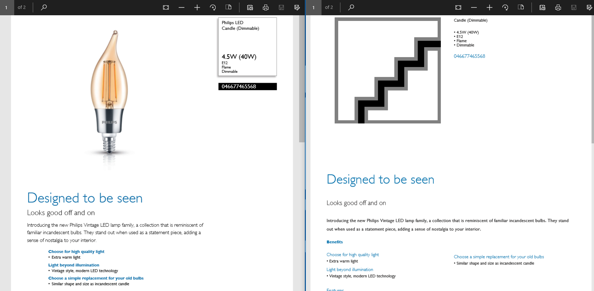
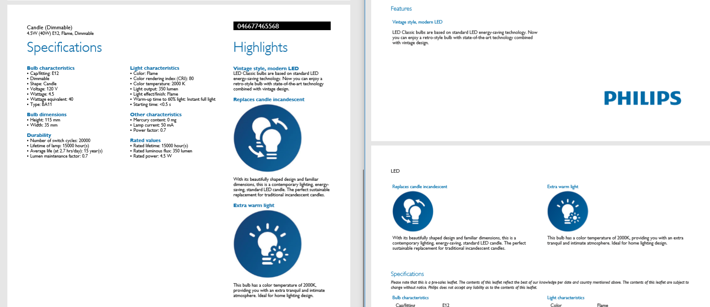
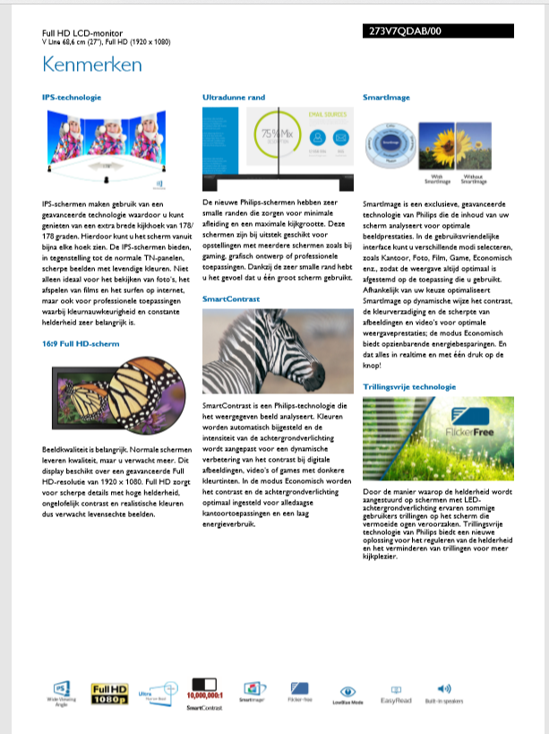

```{r setup, include=FALSE}
knitr::opts_chunk$set(echo = TRUE)

library(tidyverse)
library(kableExtra)
```

## Description

**[User Story 179402](https://dev.azure.com/PhilipsAgile/1.0%20DC%20Digital/_workitems/edit/179402) - Check rendering of features/highlighted features**


As a marketing manager
I want to see product features on the commercial leaflet and trade leaflets
in order to inform potential buyers about a product's features.

Background
Commercial leaflet rendered by the SDL Rendering solution uses FeatureHighlight elements to render features. It is not clear which features are rendered and where they appear on the leaflet.
We also need to know if FetureHighlight elements are used in the rendering of the trade leaflets (in AntennaHouse.)

Questions

  1.  Are only FeatureHighlights rendered or are all Features rendered?
  2.  Which element/attribute in the XML is used for ordering the features?


## Acceptance criteria

Clarity on which Features in the XML document are rendered and in which order for both commercial and trade leaflets.


## Conclusions


### Datamodel

With respect to the data and the presentation of the FeatureHighlight's:

  - Data is coming as-is from PFS.
  - Features are included as part of the KeyBenefitArea's,
  - Features contain information for two different presentation purposes;
    1. a short text as part of the product benefits,
    2. a long text as part of the product highlights,


#### Product benefits

  - one KeyBenefitArea can contain one or more Features,
  - KeyBenefitArea's are presented in the order specified by the KeyBenefitAreaRank,
  - Features under a KeyBenefitArea are presented in the order specified by the FeatureRank,
  *Note*: the FeatureRank and FeatureTopRank always seem to contain identical values...
  - the feature text is taken from the FeatureLongDescription,


#### Product highlights

  - the Features that are presented as product highlights are defined by the FeatureHighlight's, 
  - these Features are presented in the order specified by the FeatureHighlightRank,
  - the relation between the FeatureHighlight and KeyBenefitArea/Feature is based on the FeatureCode,
  - for each Feature, the following information is shown;
    * the FeatureName,
    * the FeatureGlossary,
    * a feature image (optional).
  - a FeatureHighlight's can have a FeatureImage (optional),
  - the relation between the FeatureHighlight and FeatureImage is based on the FeatureCode,
  *Note*: the FeatureHighlight and FeatureImage always seem to contain the same elements and data...
  *Note*: the reference to the actual asset in the Rendering message is unknown. The Rendering message does not contain assets.


### Presentation of features


#### Commercial leaflet 

  - Benefits
    * Benefits (KeyBenefitAreaName) are shown as a bulletlist directly below the MarketingTextHeader on the first page,
    * Features (FeatureLongDescription) are presented as a bullet list under the benefit,
    * the order of benefits is defined by the KeyBenefitAreaRank,
    * the order of featues is defined by the FeatureRank,
  - Highlights
    * FeatureHighlight's define the different features to be shown under the 'Highlights' section of the commercial leaflet,
    * the FeatureHighlightRank control the order in which these features are presentend,
    * the Highlight name is taken from the FeatureName,
    * the Highlight text is taken from the FeatureGlossary,
    * the Highlight image is taken from ???,
    * the number of presented highlights seems to be limited (to 6. Example is product '273V7QDAB/00', which has 10 FeatureHighlights, of which only the first 6 are shown on the commercial leaflet).

*Note*: there seem to be (at least) two templates for presenting the product on the commercial leaflet. One shows the Highlights in a column to the right of the product specifications and does not show the Highlight images as icons (example: the outdoor lamp '016523016/00'). The other shows the Highlights full-page before the product specifications and shows the Highlight images as icons below the Highlights (example: the flatscreen tv '273V7QDAB/00').


#### Trade leaflet 

Benefits and Highlight's are presented similarly on the trade leaflet as they are on the commercial leaflet, except that the header differs;

  - Benefits are presented under an explicit header 'Benefits' (the commercial leaflet doesn't show a header),
  - Highlights are presented under the header 'Features' (the commercial leaflet uses the header 'Highlights').
    * main difference with the commercial leaflet; *all* Highlights are presented.


#### Examples

The commercial leaflet is shown on the left, the trade leaflet on the right:








## Analyses of Features in the Rendering message

Three products were analysed in detail for two locales.

### Leaflets

The leaflets are taken from the PMT AssetList:

Product: <CTN>046677465568</CTN> PMT for "en_CA" (file "[046677465568_en_CA.xml](../data/PikachuInternal/PMT/046677465568_en_CA.xml)"

  - RTL = [Retail Trade Leaflet](../data/Rendering/046677465568_rtl_aenca.pdf)
  - PSS = [(commercial) Leaflet](../data/Rendering/046677465568_pss_aenca.pdf)

Product: <CTN>016523016</CTN> PMT for "nl_NL" (file "[016523016_nl_NL.xml](../data/PikachuInternal/PMT/016523016_nl_NL.xml)"

  - RTL = [Retail Trade Leaflet](../data/Rendering/016523016_rtl_nldnl.pdf)
  - PSS = [(commercial) Leaflet](../data/Rendering/016523016_pss_nldnl.pdf)

Product: <CTN>273V7QDAB/00</CTN> PMT for "nl_NL" (file "[273V7QDAB_00_nl_NL.xml](../data/PikachuInternal/PMT/273V7QDAB_00_nl_NL.xml)"

  - RTL = [Retail Trade Leaflet](../data/Rendering/273v7qdab_00_rtl_nldnl.pdf)
  - PSS = [(commercial) Leaflet](../data/Rendering/273v7qdab_00_pss_nldnl.pdf)


### Pikachu message to Rendering

Product: <CTN>046677465568</CTN> for Master (file "20181031092618_Master-CTV-Ctg_2.xml")

```
    <KeyBenefitArea>
      <KeyBenefitAreaCode>K4034413</KeyBenefitAreaCode>
      <KeyBenefitAreaName>Choose for high quality light</KeyBenefitAreaName>
      <KeyBenefitAreaRank>1</KeyBenefitAreaRank>
      <Feature>
        <FeatureCode>F400082350</FeatureCode>
        <FeatureReferenceName>2000 K [LED Lamps]</FeatureReferenceName>
        <FeatureName>Extra warm light</FeatureName>
        <FeatureLongDescription>Extra warm light</FeatureLongDescription>
        <FeatureGlossary>This bulb has a color temperature of 2000K, providing you with an extra tranquil and intimate atmosphere. Ideal for home lighting design.</FeatureGlossary>
        <FeatureRank>3</FeatureRank>
        <FeatureTopRank>3</FeatureTopRank>
      </Feature>
    </KeyBenefitArea>
    <KeyBenefitArea>
      <KeyBenefitAreaCode>K4034417</KeyBenefitAreaCode>
      <KeyBenefitAreaName>Light beyond illumination</KeyBenefitAreaName>
      <KeyBenefitAreaRank>2</KeyBenefitAreaRank>
      <Feature>
        <FeatureCode>F400082428</FeatureCode>
        <FeatureReferenceName>LEDClassic / Filament 2</FeatureReferenceName>
        <FeatureName>Vintage style, modern LED</FeatureName>
        <FeatureLongDescription>Vintage style, modern LED technology</FeatureLongDescription>
        <FeatureGlossary>LED Classic bulbs are based on standard LED energy-saving technology. Now you can enjoy a retro-style bulb with state-of-the-art technology combined with vintage design.</FeatureGlossary>
        <FeatureRank>2</FeatureRank>
        <FeatureTopRank>1</FeatureTopRank>
      </Feature>
    </KeyBenefitArea>
    <KeyBenefitArea>
      <KeyBenefitAreaCode>K4034414</KeyBenefitAreaCode>
      <KeyBenefitAreaName>Choose a simple replacement for your old bulbs</KeyBenefitAreaName>
      <KeyBenefitAreaRank>3</KeyBenefitAreaRank>
      <Feature>
        <FeatureCode>F400082392</FeatureCode>
        <FeatureReferenceName>Replaces candle incandescent</FeatureReferenceName>
        <FeatureName>Replaces candle incandescent</FeatureName>
        <FeatureLongDescription>Similar shape and size as an incandescent candle</FeatureLongDescription>
        <FeatureGlossary>With its beautifully shaped design and familiar dimensions, this is a contemporary lighting, energy-saving, standard LED candle. The perfect sustainable replacement for traditional incandescent candles.</FeatureGlossary>
        <FeatureRank>1</FeatureRank>
        <FeatureTopRank>2</FeatureTopRank>
      </Feature>
    </KeyBenefitArea>

    <FeatureImage>
      <FeatureCode>F400082428</FeatureCode>
      <FeatureReferenceName>LEDClassic / Filament 2</FeatureReferenceName>
      <FeatureImageRank>1</FeatureImageRank>
    </FeatureImage>
    <FeatureImage>
      <FeatureCode>F400082392</FeatureCode>
      <FeatureReferenceName>Replaces candle incandescent</FeatureReferenceName>
      <FeatureImageRank>2</FeatureImageRank>
    </FeatureImage>
    <FeatureImage>
      <FeatureCode>F400082350</FeatureCode>
      <FeatureReferenceName>2000 K [LED Lamps]</FeatureReferenceName>
      <FeatureImageRank>3</FeatureImageRank>
    </FeatureImage>
    
    <FeatureHighlight>
      <FeatureCode>F400082428</FeatureCode>
      <FeatureReferenceName>LEDClassic / Filament 2</FeatureReferenceName>
      <FeatureHighlightRank>1</FeatureHighlightRank>
    </FeatureHighlight>
    <FeatureHighlight>
      <FeatureCode>F400082392</FeatureCode>
      <FeatureReferenceName>Replaces candle incandescent</FeatureReferenceName>
      <FeatureHighlightRank>2</FeatureHighlightRank>
    </FeatureHighlight>
    <FeatureHighlight>
      <FeatureCode>F400082350</FeatureCode>
      <FeatureReferenceName>2000 K [LED Lamps]</FeatureReferenceName>
      <FeatureHighlightRank>3</FeatureHighlightRank>
    </FeatureHighlight>
```

### Pikachu message from PFS (PMT_Raw)

```
    <KeyBenefitArea>
      <KeyBenefitAreaCode>K4034413</KeyBenefitAreaCode>
      <KeyBenefitAreaName>Choose for high quality light</KeyBenefitAreaName>
      <KeyBenefitAreaRank>1</KeyBenefitAreaRank>
      <Feature>
        <FeatureCode>F400082350</FeatureCode>
        <FeatureReferenceName>2000 K [LED Lamps]</FeatureReferenceName>
        <FeatureName>Extra warm light</FeatureName>
        <FeatureLongDescription>Extra warm light</FeatureLongDescription>
        <FeatureGlossary>This bulb has a color temperature of 2000K, providing you with an extra tranquil and intimate atmosphere. Ideal for home lighting design.</FeatureGlossary>
        <FeatureRank>3</FeatureRank>
        <FeatureTopRank>3</FeatureTopRank>
      </Feature>
    </KeyBenefitArea>
    <KeyBenefitArea>
      <KeyBenefitAreaCode>K4034417</KeyBenefitAreaCode>
      <KeyBenefitAreaName>Light beyond illumination</KeyBenefitAreaName>
      <KeyBenefitAreaRank>2</KeyBenefitAreaRank>
      <Feature>
        <FeatureCode>F400082428</FeatureCode>
        <FeatureReferenceName>LEDClassic / Filament 2</FeatureReferenceName>
        <FeatureName>Vintage style, modern LED</FeatureName>
        <FeatureLongDescription>Vintage style, modern LED technology</FeatureLongDescription>
        <FeatureGlossary>LED Classic bulbs are based on standard LED energy-saving technology. Now you can enjoy a retro-style bulb with state-of-the-art technology combined with vintage design.</FeatureGlossary>
        <FeatureRank>2</FeatureRank>
        <FeatureTopRank>1</FeatureTopRank>
      </Feature>
    </KeyBenefitArea>
    <KeyBenefitArea>
      <KeyBenefitAreaCode>K4034414</KeyBenefitAreaCode>
      <KeyBenefitAreaName>Choose a simple replacement for your old bulbs</KeyBenefitAreaName>
      <KeyBenefitAreaRank>3</KeyBenefitAreaRank>
      <Feature>
        <FeatureCode>F400082392</FeatureCode>
        <FeatureReferenceName>Replaces candle incandescent</FeatureReferenceName>
        <FeatureName>Replaces candle incandescent</FeatureName>
        <FeatureLongDescription>Similar shape and size as an incandescent candle</FeatureLongDescription>
        <FeatureGlossary>With its beautifully shaped design and familiar dimensions, this is a contemporary lighting, energy-saving, standard LED candle. The perfect sustainable replacement for traditional incandescent candles.</FeatureGlossary>
        <FeatureRank>1</FeatureRank>
        <FeatureTopRank>2</FeatureTopRank>
      </Feature>
    </KeyBenefitArea>
    
    <FeatureImage>
      <FeatureCode>F400082428</FeatureCode>
      <FeatureReferenceName>LEDClassic / Filament 2</FeatureReferenceName>
      <FeatureImageRank>1</FeatureImageRank>
    </FeatureImage>
    <FeatureImage>
      <FeatureCode>F400082392</FeatureCode>
      <FeatureReferenceName>Replaces candle incandescent</FeatureReferenceName>
      <FeatureImageRank>2</FeatureImageRank>
    </FeatureImage>
    <FeatureImage>
      <FeatureCode>F400082350</FeatureCode>
      <FeatureReferenceName>2000 K [LED Lamps]</FeatureReferenceName>
      <FeatureImageRank>3</FeatureImageRank>
    </FeatureImage>

    <FeatureHighlight>
      <FeatureCode>F400082428</FeatureCode>
      <FeatureReferenceName>LEDClassic / Filament 2</FeatureReferenceName>
      <FeatureHighlightRank>1</FeatureHighlightRank>
    </FeatureHighlight>
    <FeatureHighlight>
      <FeatureCode>F400082392</FeatureCode>
      <FeatureReferenceName>Replaces candle incandescent</FeatureReferenceName>
      <FeatureHighlightRank>2</FeatureHighlightRank>
    </FeatureHighlight>
    <FeatureHighlight>
      <FeatureCode>F400082350</FeatureCode>
      <FeatureReferenceName>2000 K [LED Lamps]</FeatureReferenceName>
      <FeatureHighlightRank>3</FeatureHighlightRank>
    </FeatureHighlight>
```
