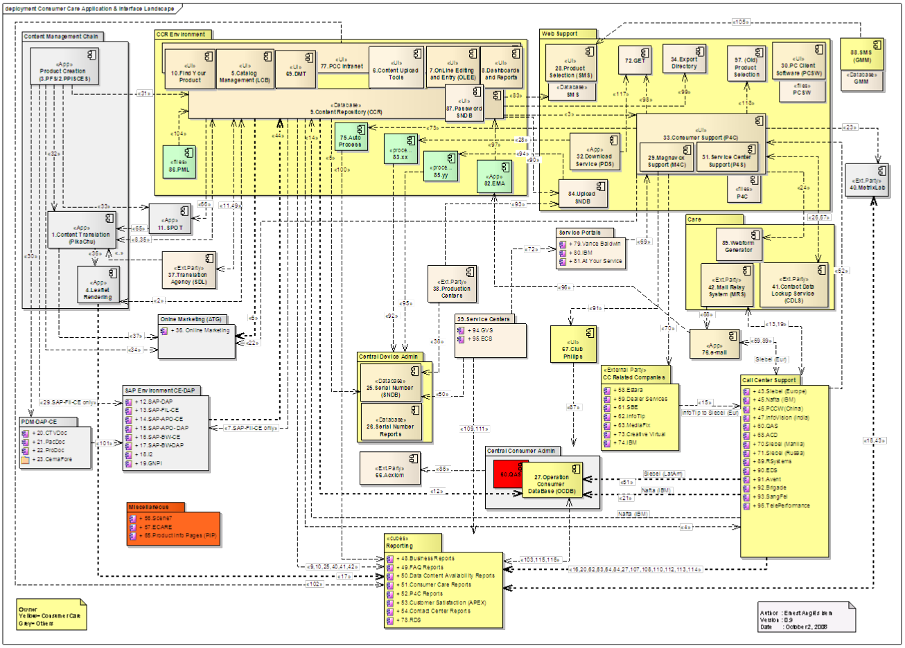

```{r setup, include=FALSE}
knitr::opts_chunk$set(echo = TRUE)

library(tidyverse)
library(kableExtra)
```

## Description

**[User Story 84417](https://dev.azure.com/PhilipsAgile/1.0%20DC%20Digital/_workitems/edit/84417) - Analysis / break down of all CCR functionality**

...


## Acceptance criteria

...


## Summary


## Analysis

### CCR

CCR = Central Content Repository

#### Functionality

Repository for 

  - assets (images, movies, documents, ...)  
  Check [doc-types](http://pww.ccr.philips.com/cgi-bin/newmpr/conf_viewer.pl?confFile=doctypes.conf&sort=2)
  - care data (P4C/PCT-feed)
  - ...


#### End-user functionality

Central product-info hub:

  - [FindYourProduct](http://pww.ccr.philips.com/ccrprd/f?p=402:100:1360897010053076)

Asset maintenance:

  - [asset upload widget](http://pww.ccr.philips.com/cgi-bin/newmpr/dcrt.pl), code1-authentication, role-based
  - [mass upload option](http://pww.ccr.philips.com/ccr_batch_upload-new.html)

  - asset search 
  - asset maintaintenance
  - reports(?)

#### Interfaces

Really many...



##### CCR Outbound interfaces

id | source   | target   | type | description
-- | -------- | -------- | ---- | -------------------------------------------------------
2 | CCR | Leaflet Rendering |  | Metadata about products & documents
3 | CCR | P4C |  | "(1) Content files, (2) Meta data files, (3) configuration files"
4 | CCR | CC-Support |  | Sends product information fro CCR to Siebel, PCCW, IBM SITEL & SENTO
5 | CCR | SNDB |  | 
6 | CCR | ATG | Database link | Metadata about products & documents
7 | CCR | SAP-FIL-CE |  | 
8 | CCR | PikaChu |  | 
9 | CCR | Reporting | Database link | Extract and load several data tables
10 | CCR | Reporting | Files | Registration of ACR sales data from SAP. This data is stored by CCR in CSV files and copied to reporting directories
11 | CCR | SDL | Batch | 
12 | CCR  | OCDB | Database link | 
25 | CCR | Reporting | Copy | Load FAQ stats 
40 | CCR | Reporting  | Files | Monthly downloads overview
41 | CCR | Reporting  | Files | Monthly OLEE statistics
42 | CCR | Reporting  | Files | Monthly Statistics overview
66 | CCR | SPOT |  | 
74 | CCR | LCB |  | 
75 | CCR | OLEE |  | 
76 | CCR | DMT |  | 
80 | CCR | Find Your Product |  | 
82 | CCR | Dashboards & Reports |  | 
83 | CCR | SMS |  | Feed to support product content from CCR
90 | CCR | Upload SNDB |  | 
99 | CCR | Export Directory | Files | The GET-script is used to deliver restricted content and for public content if the direct URL is not known.


CCR related applications:

id | source   | target   | type | description
-- | -------- | -------- | ---- | -------------------------------------------------------
19 | MRS | CC-Support | Mail | Sends e-mails from MRS to Siebel or other CC system
24 | P4C | WebForm generator |  | P4C- sends info to Webform generator and this info is send to MRS for further distribution to Philips systems


##### CCR Inbound interfaces


id | source   | target   | type | description
-- | -------- | -------- | ---- | -------------------------------------------------------
 1 | ?? | CCR |  | Languages & Countries
14 | Nafta (IBM) | CCR |  | Claims data. Process "ACR registration"
31 | PFS | CCR |  | 
35 | PikaChu | CCR |  | 
44 | SAP | CCR |  | Global product  data. Process "ACR Registration"
49 | SDL | CCR | Batch | 
77 | LCB | CCR |  | 
78 | OLEE | CCR |  | 
79 | DMT | CCR |  | 
81 | Content Upload Tools | CCR |  | 
85 | PCC Intranet | CCR | URL | 
97 | EMA | CCR |  | 
104 | PML | CCR |  | 


CCR related applications:

id | source   | target   | type | description
-- | -------- | -------- | ---- | -------------------------------------------------------
13 | CC-Support | MRS | Mail | Sends e-mails to MRS to be routed to destination
50 | Service Center | SNDB | Batch | 
69 | Service Portals | P4C | URL | A Service Portal is a web site where a Servicer logs in and is authenticated and authorized by means of a secure cookie
72 | Service Centers | Service Portals |  | 


##### Marketing content

 - Pikachu: (object)asset-list (asset metadata, including publ./interna/safe url), batch-based.
 - Pikachu: product care pages (PCT)
 - SDL Rendering: asset (asset metadata, including url), batch-based.


