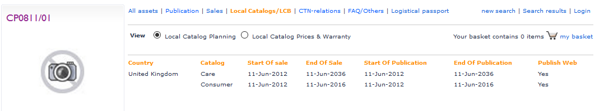
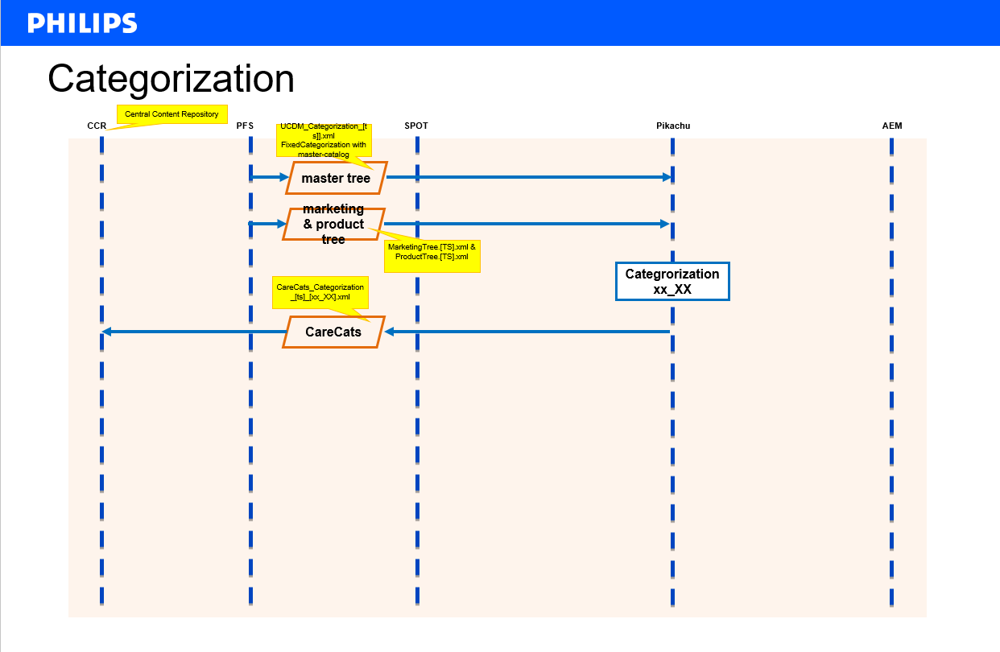

```{r setup, include=FALSE}
knitr::opts_chunk$set(echo = TRUE)

library(tidyverse)
library(kableExtra)
```

# Description

**[User Story 84417](https://dev.azure.com/PhilipsAgile/1.0%20DC%20Digital/_workitems/edit/84417) - Analysis / break down of all CCR interfaces**

# Acceptance criteria

Document is created describing outgoing and incoming CCR interfaces.


# Summary

The CCR application(landscape) has a large number of outbound and inbound interfaces.

The interfaces described in this report were identified based on (old) documentation, by analysing known related applications (eg. PFS, Pikachu, AEM), connectivity software (SIM-tool) and based on interviews.

My feeling is that the most important information/data streams are known and in scope of the program. For these, alternative sources/sinks can be defined in the new application landscape based on ADAM and STEP. Because of the technology used in the CCR application(landscape), the new interfaces will often require modifications in the connected applications. This will require early contact with the supporting (external) parties.


My worries concern the lesser known or even undocumented interfaces. As CCR has grown over the years, there seem to be many hidden 'features' and 'feeds'. Some of these may become only visible after shutdown of CCR.


# Analysis CCR

CCR = Central Content Repository


## Functionality

Repository for 

  - assets (images, movies, documents, ...)  
  Check [doc-types](http://pww.ccr.philips.com/cgi-bin/newmpr/conf_viewer.pl?confFile=doctypes.conf&sort=2)
  - product care data (P4C/PCT-feed)
  - FAQ's (Call-center related (currently obolete) and service-center related)
  - ...

## End-user functionality

Central product-info hub:

  - [Find Your Product](http://pww.ccr.philips.com/ccrprd/f?p=402:100:1360897010053076)
  - [Product Care website (P4C)](https://www.p4c.philips.com/)
  - [Product Service website (P4S)](?)

Asset maintenance:

  - [asset upload widget](http://pww.ccr.philips.com/cgi-bin/newmpr/dcrt.pl), code1-authentication, role-based
  - [mass upload option](http://pww.ccr.philips.com/ccr_batch_upload-new.html)

  - asset search 
  - asset maintaintenance
  - reports(?)

FAQ maintenance:

  - OLEE


## Interfaces

Really many...


### CCR Outbound interfaces


id | source   | target   | type | description
-- | -------- | -------- | ---- | -------------------------------------------------------
2 | CCR | Leaflet Rendering |  | Metadata about products & documents
3 | CCR | P4C |  | "(1) Content files, (2) Meta data files, (3) configuration files"
4 | CCR | CC-Support |  | Sends product information from CCR to call-center applications: Salesforce (formerly: Siebel), (discontinued: PCCW), (discontinued: IBM SITEL & SENTO)
6 | CCR | AEM-PRX | Files | Zip-files with product-care data per locale (PCT-feed). Transferred with the SIM-tool (CCR-to-cq5-PRX process)
8 | CCR | PikaChu |  | Object-Asset-List, Asset-List (? see process 66), product care texts (PCT-Raw).
66 | CCR | SPOT |  | Asset-List (?). According to the old documentation, SPOT receives the Asset-List from CCR and forwards a delta-filtered Asset-List to Pikachu. It's not clear if Pikachu receives this data from SPOT or directly from CCR.
74 | CCR | LCB | database | Local catalog Builder application is build directly on the CCR database.
75 | CCR | OLEE |database  | OLEE (FAQ maintenance) application is build directly on the CCR database.
76 | CCR | DMT | database | Data managenment toolkit (asset configuration, site configuration for website, rendering, other...) is build directly on the CCR database.
80 | CCR | Find Your Product |  | FYP application is build directly on the CCR database.
82 | CCR | Dashboards & Reports |  | Feed to Eloqua (product hierarchy and categorization)
-- | CCR | Scene7 | files | Publication of (product) video's to Scene7, delivered with SIM-tool (ccr-to-scene7-videos)
-- | CCR | Scene7 | files | Publication of (product) asset's to Scene7 (indirectly through Pikachu)
-- | CCR | Tns-Nipo | files | Product (related) data in csv-format, delivered with SIM-tool (ccr_to_tns_nipo_upload process)
-- | CCR | TPVisionData | files | categorization, chassis, docs, doc-types, locales, product description, delivered with SIM-tool (ccr_to_TPVisionData_upload process)
-- | CCR | CC-Support |  | Sends product information from CCR to Call-Center China. 
7 | CCR | SAP-FIL-CE |  | now: SAP-XI : routing of XML-files on request of SAP for third-parties. #TODO: Check!
99 | CCR | Export Directory | Files | The GET-script is used to deliver restricted content and for public content if the direct URL is not known. Eg. used by SDL to retrieve the actual images based  on the list with metadata send in id=2.


Outbound-interfaces (discontinued):

id | source   | target   | type | description
-- | -------- | -------- | ---- | -------------------------------------------------------
5 | CCR | SNDB |  | discontinued: Serial number database
9 | CCR | Reporting | Database link | Extract and load several data tables
10 | CCR | Reporting | Files | discontinued: Registration of ACR sales data from SAP. This data is stored by CCR in CSV files and copied to reporting directories. Now: CCR receives sales-indicator in order to keep products online on the Care-site.
11 | CCR | SDL | Batch | Was used to initiate translation reqiuests for OLEE documents.
12 | CCR  | OCDB | Database link | discontinued: 
25 | CCR | Reporting | Copy | discontinued: Load FAQ stats 
40 | CCR | Reporting  | Files | discontinued: Monthly downloads overview
41 | CCR | Reporting  | Files | discontinued: Monthly OLEE statistics
42 | CCR | Reporting  | Files | discontinued: Monthly Statistics overview> Now; via AEM analytics.
83 | CCR | SMS |  | discontinued: Feed to support product content from CCR
90 | CCR | discontinued: Upload SNDB |  | 


Sources: 

- [CC-Architecture-7-10-2008, V0.9.xlsx](./CCR/CC-Architecture-7-10-2008, V0.9.xlsx)
- Pikachu
- SIM-tool
- interview Paul der Kinderen (2019-03-07)


CCR related applications:

id | source   | target   | type | description
-- | -------- | -------- | ---- | -------------------------------------------------------
19 | MRS | CC-Support | Mail | Sends e-mails from MRS to Siebel or other CC system. Status unknown. Applicatoi nstill exsits, but is it used.
24 | P4C | WebForm generator |  | P4C- sends info to Webform generator and this info is send to MRS for further distribution to Philips systems


### CCR Inbound interfaces

id | source   | target   | type | description
-- | -------- | -------- | ---- | -------------------------------------------------------
 1 | ?? | CCR |  | Languages & Countries. On project basis new data is entered using DMT and SQL scripts.
31 | PFS | CCR |  | multiplke interfaces to get tree- and product data from PFS. Also Localisation tool, for example for localisation of assets. Functoinality that will be replaced by STEP and ADAM. 
35 | PikaChu | CCR |  | 
49 | SDL | CCR | Batch | upload of rendered leafletds (including the metadata)
77 | LCB | CCR |  | 
78 | OLEE | CCR |  | 
79 | DMT | CCR |  | 
85 | PCC Intranet | CCR | URL | Philips Content Care intranet (CCR intranet)
-- | ACD_SITEL |CCR | files | unknown data to call-center(?) company, delivered with SIM-tool (ACD_SITEL_to_ccr process). Active interface, but the CC is no longer used... 


Inbound-interfaces (discontinued):

id | source   | target   | type | description
-- | -------- | -------- | ---- | -------------------------------------------------------
14 | Nafta (IBM) | CCR |  | discontinued: Claims data. Process "ACR registration"
44 | SAP | CCR |  | discontinued: Global product  data. Process "ACR Registration"
81 | Content Upload Tools | CCR |  | discontinued: 
97 | EMA | CCR |  | discontinued: ? unknown
104 | PML | CCR |  | discontinued: used for creating products data in CCR in alternative way.

Sources: 

- [CC-Architecture-7-10-2008, V0.9.xlsx](./CCR/CC-Architecture-7-10-2008, V0.9.xlsx)
- Pikachu
- SIM-tool
- interview Paul der Kinderen (2019-03-07)


CCR related applications:

id | source   | target   | type | description
-- | -------- | -------- | ---- | -------------------------------------------------------
13 | CC-Support | MRS | Mail | Sends e-mails to MRS to be routed to destination
50 | Service Center | SNDB | Batch | 
69 | Service Portals | P4C | URL | A Service Portal is a web site where a Servicer logs in and is authenticated and authorized by means of a secure cookie
72 | Service Centers | Service Portals |  | 


### CCR interfaces break-down by purpose

The above interfaces are many and diverse. To make the assignment manageable, the interfaces will be grouped by purpose. For each group, the status, content and interface details will be described.

The group of interfaces that are most relevant to the "PIL BCD Digital 2.0 Content"-project are:

  1. Product marketing content
  2. Product care content
  3. Product service content
  4. generic content (eg assets used by all of the above)


#### Product marketing content (website/leaflet rendering)

CCR feeds to Pikachu and SDL Rendering:

 1. Pikachu: (object)asset-list (asset metadata, including publ./internal/safe url), batch-based.
 3. SDL Rendering: asset (asset metadata, including url), batch-based.
 4. SDL Rendering: assets (physical asset files), GET-scripts.

CCR feeds from Pikachu and SDL Rendering:

 6. SDL Rendering: Leaflets (and corresponding metadata and images).


##### 1. Product assets


###### a. Asset-List export

Product-related assets, like Standard Product Photo,commercial leaflet, etc.

|         |                                                                        | 
| ------- | ---------------------------------------------------------------------- |
| purpose | a. publish product assets (physical files) to Adobe Scene7 (integrated, rich media management, publishing, and serving environment). | 
|         | b. publish product assets (logical files/url's) as part of the product-feed to the Philips marketing website. |
| asset-types | see document ["100_SyndicationChannels_consolidated.xlsx"](100_SyndicationChannels_consolidated.xlsx), tab "Assets". |
| type    | batch |
| frequency | daily |
| remarks | a. Assets are exported from CCR through SPOT to Pikachu. SPOT implements delta-filtering. Pikachu retrieves the Asset physical files and publishes these to Scene7. Pikachu includes the Asset logical files/url's into the feeds to the AEM website. |
|         | b. The assets are localised. |
|         | c. The AssetList only contains the MD5-checksum (and the doc-type) to identify the asset. |


###### b. Object-Asset-List export

Object-related assets, like feature images, awards, etc.

|         |                                                                        | 
| ------- | ---------------------------------------------------------------------- |
| purpose | a. publish category/feature assets (physical files) to Adobe Scene7 (integrated, rich media management, publishing, and serving environment). | 
|         | b. publish category/feature assets (logical files/url's) as part of the product-feed to the Philips marketing website. |
| asset-types | see document ["100_SyndicationChannels_consolidated.xlsx"](100_SyndicationChannels_consolidated.xlsx), tab "Assets". |
| type    | batch |
| frequency | daily |
| remarks | a. Assets are exported from CCR through SPOT to Pikachu. SPOT implements delta-filtering. Pikachu retrieves the Asset physical files and publishes these to Scene7. Pikachu includes the Asset logical files/url's into the feeds to the AEM website. |
|         | b. The assets are localised. |
|         | c. The ObjectAssetList only contains the MD5-checksum (and the doc-type) to identify the asset. |


###### c. Assets-2-SDL export

|         |                                                                        | 
| ------- | ---------------------------------------------------------------------- |
| purpose | publish product assets (logical files/url's for both assets and object-assets) to enable SDL-Rendering include images on the leaflets. |
| asset-types | *unknown* |
| type    | batch |
| frequency | daily |
| remarks | SDL retrieves the actual assets from CCR based on its own delta-filtering mechanism and by using the CCR GET-scripts (see id = 99). |
|   | The product-data required for the leaflets is send from Pikachu (RenderingExport (full & delta)) by using the SIM-tool (pikachu-to-rendering process). |


###### d. SDL-leaflets-2-CCR import

|         |                                                                        | 
| ------- | ---------------------------------------------------------------------- |
| purpose | Import the commercial leaflets generated by SDL. |
| asset-types | commercial leaflets (PSS) |
| type    | batch |
| frequency | daily |
| remarks | The import must include leaflet metadata (product-id, locale, creation date). The data is retrieved using the SIM-tool (rendering-to-ccr process). |


###### d. OLEE-import

Notes: 

  1. still required? OLEE for call-centers is obsolete. What is status of OLEE for service centers?
  
###### e. SAP-import

###### f. PFS-import

###### g. SPOT-export


#### Product care content (Salesforce/p4c)

CCR feeds to Pikachu:

 2. Pikachu: product care texts (PCT), batch-based.

CCR feeds from Pikachu:

 5. Pikachu: Care Categorization

##### 2. Product care content (PCT)

###### a. Pikachu: Product catalogs-export


|         |                                                                        | 
| ------- | ---------------------------------------------------------------------- |
| purpose | publish product publication status (published/archived, sop/eop) to the Care-website. Note: this feed also controls which product-data to send by the middleware (Pikachu) to AEM. | 
| type    | batch |
| frequency | daily |
| remarks | Locale (country) specific export |

Content:

- catalogTypeName ("CARE")
- countryCode (2-letter iso-country-code, eg "NL")
- currencyCode (3-letter iso-currency-code, eg "EUR")
- productDivisionCode (eg "0900")
- product-ID (CTN)
- sop
- eop
- sop-marketing
- eop-marketing
- action ("add", "delete")
- buy-on-line (default "N")
- list-price-to-dealers (always empty)
- local-going-price (always empty)
- online-price (always empty)
- gtin (always empty)
- priority (always empty)


###### b. Pikachu: Product care content-export


|         |                                                                        | 
| ------- | ---------------------------------------------------------------------- |
| purpose | publish product cate content to the Care-website. | 
| type    | batch |
| frequency | daily |
| remarks | delta-export. Locale (language & country) specific export. The middleware (Pikachu) enriches the data before exporting to the Care-website. |

Content (import):

  - Product-ID (CTN)
  - ProductName
  - ShortDescription
  - Product-type (always "Normal")
  - ProductImage (eg. "files/1/107b75_27/107b75_27_rtf_.jpg". Used?)
  - HasSoftwareAsset
  - ProductDivisionCode
  - ProductDivisionName
  - BrandCode
  - BrandName
  - BrandString
  - ProductReference (Type="isRefurbishedProductOf") to Product-ID (CTN)
  - RichTexts (always "empty")
  
Added content (enriched/export):

  - PartnerBrandCode
  - PartnerBrandName (Avent)
  - PartnerBrandType
  - DescriptorName
  - DescriptorCode
  - VersionElementCode
  - VersionElementName
  - BrandedFeatureString
  - DescriptorBrandedFeatureString
  - Assets (PSS (global and local), GLL, DFU)
  
  
Notes:

  * many products that should be published to the care-site are not. Example: CP0811/01, Philips precision trimmer CP0803/01.  
  
  
  
  Although this product was included in the feed from CCR to Pikachu (masterLastModified="2019-02-27T01:02:11").
  
  
  
  Product can indeed not be found on the Philips-website (resulting in a shit-load of alternative products...).


###### c. Pikachu: Product categorization-export



|         |                                                                        | 
| ------- | ---------------------------------------------------------------------- |
| purpose | publish product categorization-structure to the Care-website. | 
| type    | batch |
| frequency | daily |
| remarks | No Care-specific categorization found. The Product-tree, Marketing-tree and professional-tree are send in the FixedCategorization-format. No differentiation between countries. |

Content:

- CatalogCode
- CatalogName
- GroupCode
- GroupName
- GroupRank
- CategoryCode
- CategoryName
- CategoryRank
- SubcategoryCode
- SubcategoryName
- SubcategoryRank
- Product-ID (CTN)


#### Product service content (p4s)


#### Generic content

##### Asset export

###### a. images/documents export

The CCR-2-Pikachu feed is described in the paragraph "AssetList-export".

In addition, assets can be fetched from CCR using the (s)GET-scripts.


###### b. videos export

|         |                                                                        | 
| ------- | ---------------------------------------------------------------------- |
| purpose | publish (product)video's to Scene7. | 
| type    | batch |
| frequency | daily |
| remarks | Delivered by the SIM-tool (ccr-to-scene7-videos process). |


##### Local Catalog Builder (LCB)

###### a. LCB inbound interface

This LCB interface is not a physical interface between two applications as the LCB application is part of the CCR application landscape and is build on the CCR database.
Therefore this interface can be considered to be a 'logical' interface.


###### b. LCB outbound interface

This LCB interface is not a physical interface between two applications as the LCB application is part of the CCR application landscape and is build on the CCR database.
Therefore this interface can be considered to be a 'logical' interface.

##### Find Your Product (FYP)

###### a. FYP interface

This FYP interface is not a physical interface between two applications as the FYP application is part of the CCR application landscape and is build on the CCR database.
Therefore this interface can be considered to be a 'logical' interface.