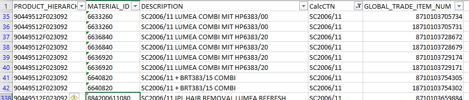

```{r setup, include=FALSE ,echo=FALSE}
knitr::opts_chunk$set(echo = TRUE)

# load required libraries
library(tidyverse)
library(kableExtra)

# load data (preparted with the script "./code/510_queryCCR_packagingInfo.R")
load(file = "../code/data/logistic_data_cleaned.RData")
```

# Assumption

The purpose of this script is to test the assumption that when multiple unique values for the GTIN (global trade item number) are available, the smallest value for the GTIN corresponds with the packaging-type 'piece'.


# Approach

The assumption is tested by

  1. retrieve the packaging information for all products in the CCR Production database,
  2. match the packaging information with the provided list of IPL products (document "LogisticProductList_IPL.xlsx"),
  3. group the products per CTN,
  4. sort on the GTIN within each group,
  5. assert that the lowest GTIN corresponds with the smallest packaging type.


# Test assumption

## Verify approach

The assumption is first checked for one test-product: "SC2006/11".



Packaging-types present in the CCR database:

```{r echo=FALSE}
ccr_logistic_data.c %>%
  dplyr::select(PKGT_CD, PKGT_NAME) %>%
  dplyr::distinct(PKGT_CD, .keep_all = TRUE) %>%
  dplyr::arrange_all() %>%
  kableExtra::kable(caption="Unique packaging-types") %>%
  kableExtra::kable_styling()
```


The IPL product data is filtered on the CTN and matched (joined) with the packaging information from the CCR Production database:

```{r echo=FALSE}
logisticProductList.c %>%
  dplyr::filter(CalcCTN == "BRI861/00") %>%
  dplyr::select(CalcCTN, LP_GTIN, GLOBAL_TRADE_ITEM_NUM, PKGT_NAME, PKG_NR_OF_ITEMS) %>%
  kableExtra::kable(caption="Active exports without FTP process") %>%
  kableExtra::kable_styling()
```

Based on the information in the table, the smallest GTIN indeed seems to correspond with the smallest packaging type.

Note that none of the GTIN-values in the list with IPL-products corresponds with an "inner carton".


## Final results

When the assumption that the smallest value for the GTIN corresponds with the packaging-type 'piece' (ccr packaging name is 'set') is true, none of the records with the smallest value for the GTIN should have a number of items greater than 1.


```{r}
logisticProductList.checked <-
  logisticProductList.c %>%
  # remove those IPL products for which no packaging data was found in CCR:
  dplyr::filter(!is.na(PKGT_CD)) %>% 
  # only keep relevant columns from the data-set:
  dplyr::select(CalcCTN, LP_GTIN, GLOBAL_TRADE_ITEM_NUM, PKGT_NAME, PKG_NR_OF_ITEMS) %>%
  # perform grouping, determine smallest gtin and join with the ccr package descriptions:
  dplyr::group_by(LP_GTIN) %>%
  summarize(smallest_gtin = min(GLOBAL_TRADE_ITEM_NUM)) %>%
  dplyr::left_join(ccr_logistic_data.c,
                   by = c("LP_GTIN" = "LP_GTIN", "smallest_gtin" = "GLOBAL_TRADE_ITEM_NUM")) %>%
  # select records that have more than one items in a package-type:
  dplyr::filter(PKG_NR_OF_ITEMS > 1)

# verify that no records exist that have more than one items in a package-type:
dim(logisticProductList.checked)[[1]]
```

# Conclusion

The assumption is true.