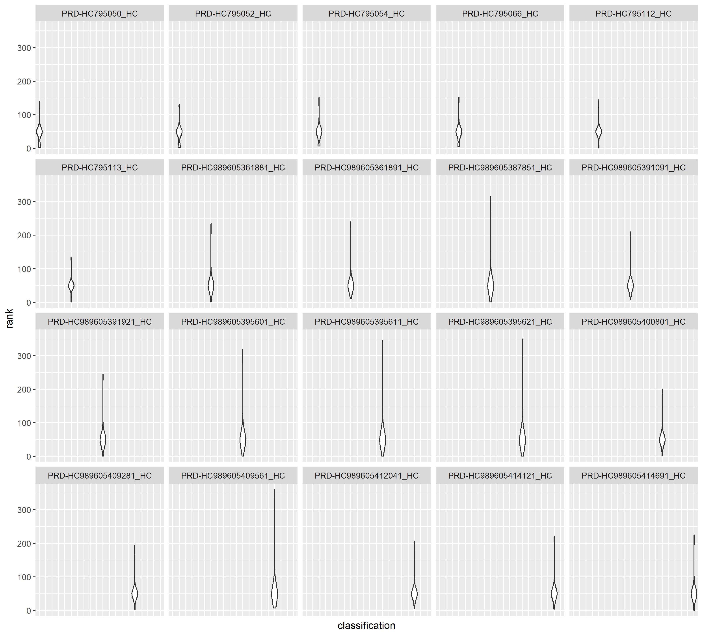
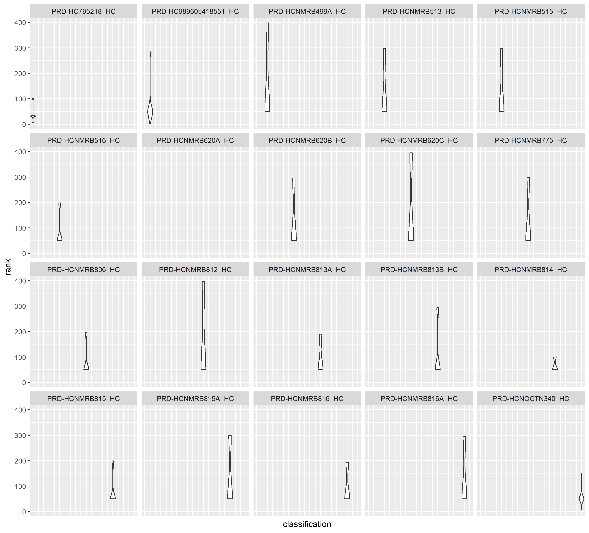
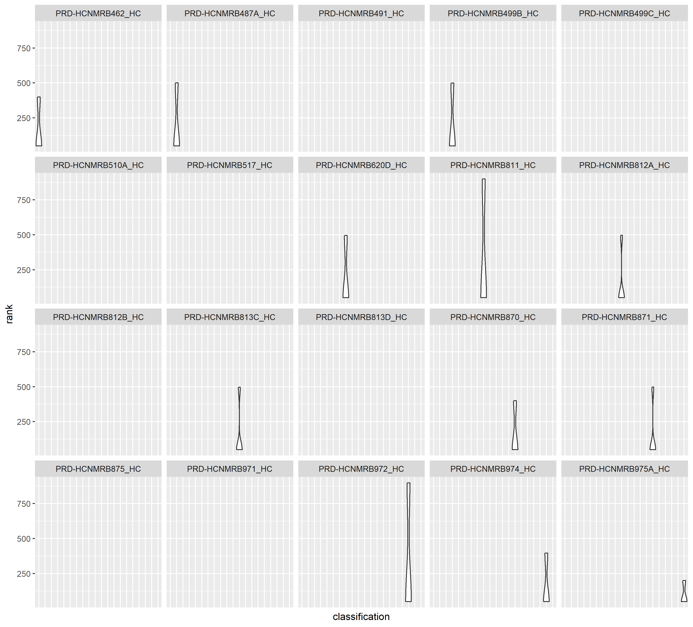
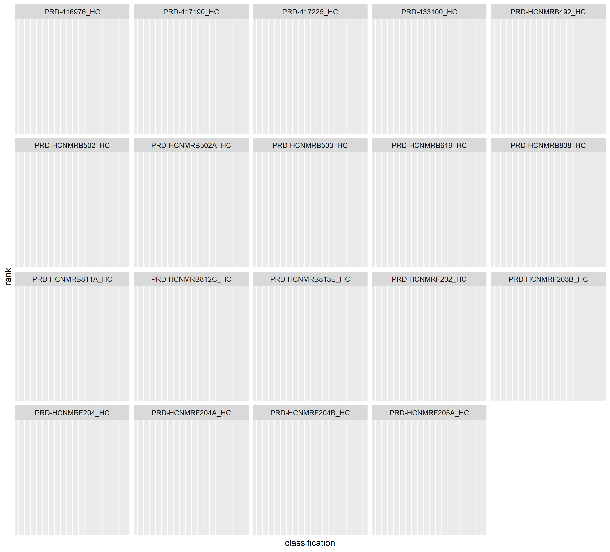

```{r setup, include=FALSE}
knitr::opts_chunk$set(echo = TRUE)

library(tidyverse)
library(kableExtra)
```

# Summary

The report lists the categorization levels with a rank higher than 99. In total, 79 such classification levels were found. These classification levels are presented in a table in the paragraph 'Analysis and results'.


# Details

## Introduction

Because the values of the rank-attribute in the categorization tree need to be down-scaled from 0-999 to 0-99, an analysis is performed on

1. how many entries have a rank-value higer than 99
1. which entries have a rank-value higer than 99
1. which contexts have entries with a rank-value higer than 99


## Data

The data has been provided as a STEP XML export by Sabine Heineman, date 15-05-2019.


## Data pre-processing

The data have been converted from XML to csv-format using XSLT. The nested XML-structure has been flattened to a row per catalog-entry, with variables catalog-id, catalog-name, locale, rank.


```{r echo=TRUE, message=FALSE, warning=FALSE, paged.print=FALSE}
# read data
catalog.r <-
  readr::read_csv("../data/csv/600_catalog_rank.csv",
                   col_types = "ccci") # 3x character and an integer for the rank

glimpse(catalog.r)
```

```{r echo=FALSE}
###############################################################################
# clean data: not required
###############################################################################
catalog.c <-
  catalog.r
```


## Analysis and results

Some quick insight on 

  * total number of classification-records (all classifications, all locales),
  * the minimum and maximum values of the rank,
  * the minimum and maximum values of the rank for values where the rank > 99
  
```{r echo=TRUE, warning=FALSE, paged.print=FALSE}
# number of classifications-entries
(count_total <-
  nrow(catalog.c))

# number of classifications-entries with a rank > 99
(count <-
  catalog.c %>%
  dplyr::filter(rank > 99) %>%
  dplyr::count())

# all extremes
catalog.c %>%
  dplyr::summarise(minRank = min(rank),
                   maxRank = max(rank))

# extremes for rank > 99
catalog.c %>%
  dplyr::filter(rank > 99) %>%
  dplyr::summarise(minRank = min(rank),
                   maxRank = max(rank))
```

So the total number of classifications is `r count_total`, out of which `r count` have a rank higher than 99.

The following table shows the number of occurances of a rank with a value larger than 99 per locale.

```{r echo=TRUE, warning=FALSE, paged.print=FALSE}
# unique ranks with rank > 99 and the number of occurances
catalog.c %>%
  dplyr::filter(rank > 99) %>%
  dplyr::group_by(locale) %>%
  dplyr::summarise(count = n()) %>%
  dplyr::arrange(locale, -count) %>%
  # present as table
  kableExtra::kable(caption = "Locales with rank > 99 and the number of their occurances") %>%
  kableExtra::kable_styling()
```

Conclusion; there are only a few locales with a rank higher than 99, with most occurances for the global locale.

Are there any rank-values that have been assigned to multiple classifications?

```{r echo=TRUE, warning=FALSE, paged.print=FALSE}
# non-unique ranks (with rank > 99) and the number of occurances
catalog.c %>%
  dplyr::filter(rank > 99) %>%
  dplyr::group_by(locale, rank) %>%
  dplyr::summarise(count = n()) %>%
  dplyr::filter(count > 1) %>%
  dplyr::arrange(locale, -count) %>%
  # present as table
  kableExtra::kable(caption = "Non-unique rank-values (for ranks > 99)") %>%
  kableExtra::kable_styling()
```

Conclusion; there are none.

The `r count` categorizations with a rank > 99 are shown in the following table.

```{r echo=TRUE, warning=FALSE, paged.print=FALSE}
# show classifications that need to be updated.
catalog.c %>%
  dplyr::filter(rank > 99) %>%
  dplyr::arrange(locale, -rank, id) %>%
  # present as table
  kableExtra::kable(caption = "Classifications with rank > 99 that need to be updated") %>%
  kableExtra::kable_styling()
```

Finally, some plots are presented with the value distribution of the rank per classification-level. These plots show how the rank of a classification can vary for the different locales.
Because the number of classifications is large, four different plots have been created.
*Note*: click on the plot for a larger picture.








