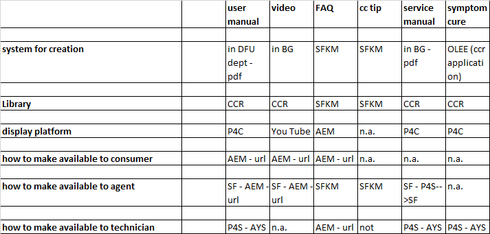

```{r setup, include=FALSE}
knitr::opts_chunk$set(echo = TRUE)

library(tidyverse)
library(kableExtra)
```

## Sources

The presented information is based on meetings with:

  - Rajiv Swami - Service Manager Global Claims & Analytics PH Consumer Care Europe & APAC (date: 2019-01-30)
  - Reinier Gratama - Director Consumer Care BG Coffee (date: 2019-02-07)

#### Other contacts

  - Janne van Herpt - expert in knowledge management systemen Support (salesforce knowledge management)
  - Udo Jungbluth - technical support, responsible for the service center documentation maintenance and publication.
  - Nico Minaerts - PO Service


## Service Centers

The service centers, both the global and local centers, handle claims and service requests that come from both retailers and consumers.
The applications that are used by the service centers are shown in the following overview:


The applications used by the service centers that are either part of the CCR application landscape or interfacing with CCR are:

  1. At Your Service (AYS)
  2. Salesforce
  3. Find Your Product (FYP)


## Call Centers


The information sources used by the call centers are:

  


Abreviations: 

- AEM = consumer website
- DFU = 
-	SF = Salesforce
-	SFKM = Salesforce knowledge management
- P4C = care website
- P4S = service website
- AYS = At Your Service
- OLEE = On-Line Editing & Entry tool (replaced with SFKM)

The applications used by the service centers that are either part of the CCR application landscape or interfacing to CCR are:

  1. Consumer website (AEM)
  2. Care website (P4C)
  3. Service website (P4S)
  4. Salesforce
  5. Find Your Product (FYP)
  6. At Your Service (AYS)


## Applications and interfaces


### At Your Service (AYS)

At Your Service (AYS) is the most important application in use with the service centers, less-used by the call centers.

The AYS application shows the product id (CTN code), a product image and product description.
Amongst other functionality, it can be used to find product service manuals. These service manuals are retrieved from CCR based on links (*Note* that the service manuals are not duplicated and stored locally in the AYS application).
The availability of the product service manuals is based on roles in the application. Product service manuals are only available to the workshops (= repair centers).

Call center information (another role) provides eg a kind of FAQ: questions & answers.

OnlinetTool: Service Network Support

*Notes*: 

  1. product-search is possible on both CTN and chassis number (chassis can possibly be ignored in the future),
  2. FAQ's in AYS (OLEE based, from CCR) can be ignored and need to be replaced by the more up-to-date FAQ's in Salesforce KM. *This interface between AYS and Salesforce is not yet on the road-map*.


#### Overview of data and source of the data

| source      | information | interface | refresh frequency |
| ----------- | ---------------------------------------- | --------- | ----------------- |
| CCR         | Product CTN       | link to P4C/P4S        | n.a.              |
| CCR         | Product image     | link to P4C/P4S        | n.a.              |
| CCR         | Product description     | link to P4C/P4S        | n.a.              |
| CCR         | Product service manuals | link to P4C/P4S        | n.a.              |
| CCR         | FAQ's             | link to P4C/P4S        | n.a.              |

In short, it looks like the required product information is retrieved through a direct link to the P4C/P4S-product pages (**TODO**: verify interface). 


#### Technology

? ...*unknown*


#### Contacts

IT repsonsible: Ton Huybers (tech lead)


### Salesforce

Salesforce is the customer relation management (CRM) application. Salesforce is the replacement of the previously used Siebel CRM application.

For the call centers, Salesforce is the first point of contact with consumers/retailers. The call centers need information on product CTN/12nc in order to log calls and find product information.

In Salesforce, the product publication dates (sop/eop from CCR/LCB) are available, based on an interface with Pikachu that provides information from PFS and CCR/LCB. 

Known issues:

  1. (Service centers)  
  If the product identification or publication info is not available in Salesforce, a case (when a consumer complaints) for a product can not be created in Salesforce.  
  *Note*: it sometimes occurs that publication dates are not available, although the products are being sold. Than a case can not be created and an IT-ticket is required to get the product entered/updated in CCR/LCB and interfaced to Salesforce. It takes 2-3 days to get the sop/eop in Salesforece after an update in LCB.  
  *Note*: The call Centers in China  do not use Salesforce, but they can accesss thee same data. But thow?
China uses CCFS. GThis application gets its product data through a datahub called RCDH.  
**TODO** check documentation on RCDH.
  The Call Centers in China do not use AYS either!  
  2. (Call centers)  
  Not all products are known in Salesforce, although these are shown on the website. 
A possible cause is that these products are maintained in STEP/other applications and the feed from this application to Salesforce does not yet exist.  
This issue is known with Patrick van Nuland.  
Example: [Sleep /respiratory care products](https://www.philips.co.uk/healthcare/solutions/sleep-and-respiratory-care).
    - [HC1043941](https://www.philips.co.uk/healthcare/product/HC1043941/alice-pdx-portable-sleep-diagnostic-system) : not in Salesforce/CCR/FYP/Pikachu.
    - [HC1133430](https://www.philips.co.uk/healthcare/product/HC1133430/dreamwear-full-face-cushion-under-the-nose-full-face-cushion) : not in Salesforce/CCR/FYP/Pikachu.


#### Overview of data and source of the data

The product data in Salesforce are provided by three feeds from Pikachu:

  1. XCProducts (daily export, xUCDM v1.1.2, with channel-specific modifications. Eg. this feed includes the Service Manuals (type="SMA").),
  2. XCCatExport (daily export, custom (website) categorisation format),
  3. XCDescriptor (daily export, only Master-data, in 'FixedCategorization' format, will no be implemented for PIL).
  
*Note*: 

  1. "XC" stands for "Xcellent Care".
  2. this interface is a modified version of the documented interface between CCR/LCB and Siebel (see document 1). The Siebel format was more-or-less used 1-on-1 for the interface with Salesforce.
  3. Because Pikachu can't deliver all product data, this feed is merged with a feed from CCR (for Care-products ?) before it's imported into Salesforce. This merge is implemented in Informatica.
  4. the actual message delivery from Pikachu to Informatica is unknown. No entry in the "SIM-tool" was found.


| source      | information | interface | refresh frequency |
| ----------- | ---------------------------------------- | --------- | ----------------- |
| CCR         | Product CTN                              | XCProducts         | daily              |
| CCR/LCB     | Product sop/eop                          | XCProducts         | daily              |
| CCR         | Product manual (DFU)                     | XCProducts: direct link to P4C/P4S | daily              |
| CCR         | Product Leaflet (PSS)                    | XCProducts: direct link to P4C/P4S | daily              |
| CCR         | Product support page                     | XCProducts: direct link to P4C/P4S | daily              |
| CCR         | Product support page (FAQs)              | XCProducts: direct link to P4C/P4S | daily              |
| CCR         | Product support page (scripts)           | XCProducts: direct link to P4C/P4S | daily              |


#### Technology

'Out-of-the-box' application


#### Contacts

IT repsonsible: ?


### Find Your Product (FYP)

The FYP Application is used by service centers, call centers, product marketing, other. 
This application is used by global support (Ehvn & Amsterdam) and by Local (country) support.

*Note*: it is also used by 'logistics'. **TODO**: check the details

Accessible through VPN and when on the Philips local network.

Large user base:

  - 200 contact centers, 200-300 users (order-of-magnitude estimate Reinier), via intern netwerk of VPN
  - everyone in service uses the application regularly. Pm 300 service users. 

Important information: basically everything is currently available in FYP. Both the service- and call-centers want to keep having access to all the information currently available in FYP.

Find Your Product (FYP) is most often used to check the publication status of products for different countries. In addition, product assets are retrieved with FYP.

Additional information:

  - sales information (*estimated* amount of products sold in a country),
  - product assets, mostly service guides, also quality- and environemental related.  
  Used by customer support and repair centers, 
  - product accesoire relations
  - product predecessor/successor information
  - FAQ's ("test"-product: QT4001/15)  
  *Note*: CCR/FYP On-Line Editing & Entry tool (OLEE)-based FAQ's have been migrated into Salesforce. CCR/FYP OLEE-based FAQ'sare beeing phased out. **TODO**; check completeness.
  


#### overview of data and source of the data

| source      | information | interface | refresh frequency |
| ----------- | ---------------------------------------- | --------- | ----------------- |
| CCR         | Product CTN         | DB        | n.a.              |
| CCR         | Product image       | DB        | n.a.              |
| CCR         | Product description | DB            | n.a.              |
| CCR/LCB     | Product sop/eop     | DB        | n.a.              |
| CCR         | Product assets      | link to file-system           | n.a.              |
| CCR         | Product amount sold | DB            | n.a.              |
| CCR         | Product predecessor | DB            | n.a.              |
| CCR         | Product successor   | DB            | n.a.              |
| CCR         | Product support page (FAQs)              | direct link | ?              |
|             |             |           |                   |


#### Technology

FYP is one of the applications that is part of the CCR landscape. It's developed with Oracle APEX as UI and the data is stored in an Oracle database.


#### Contacts

Functional: Joost Hungerink

IT repsonsible: Paul der Kinderen (?)


### Document Management System (DMS)

DMS is, for example, used to store proof that a consumer bought a product (receipts).
DMS is not connected to CCR (as far as Rajiv knows).

*Note*:  
Product/service related documents in DMS can be uploaded (by consumers) through the Consumer Portal. These are also available in AYS. *These documents are out of our 'view'*!


#### overview of data and source of the data

- none


#### Technology

DMS is based on Microsoft Sharepoint. 


#### Contacts

IT repsonsible: ?


## Documentation

1. Product Detail Support page - Functional requirements of the Product Detail Support page, by Peter Ruiter. 
(P4C_Requirements-working_draft.doc, version 0.8h  2009-04-07)


## Open questions


 1. who maintains the info required for claimes, like service manuals, etc?

Rajiv's department does not maintain the documentation, FAQ's, etc. 

Who does maintain this?

--> Ask Udo for the technical info. DS for the product data.

THe service manual is updated, there are no different manuals for different years (for products containing different parts.)
Udo Jungbluth = technical support person, responsible for the documentation maintenance and publication.


  3. does it make sense to generate the current support pages as static html and start publishing new support pages for products from Stibo STEP from the go-live onward?  
  Motivation; the current support landscape is *large, complex and has scattered documentation*, making it *hard* to migrate the data, the interfaces, etc. 


