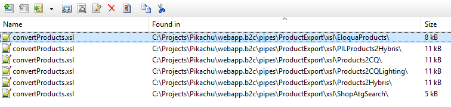

```{r setup, include=FALSE}
knitr::opts_chunk$set(echo = TRUE)
```

## Product export

Custom code for:

1. sql_selectProducts.xsl
2. sql_getLocaleProducts.xsl
3. convertProducts.xsl

### sql_selectProducts.xsl

Looks like a less complete and less efficient version of the base code

Less complete:

  - no support for secure url
  
  
Less efficient:

  - reset of CLE-table (update-statement updates all channel rows instead of the ones that need to be updated).
  
### sql_getLocaleProducts.xsl

Looks like a less complete and less efficient version of the base code

Less complete:

  - no support for secure url
  - no support for -- B2C catalogs
  
Less efficient:

  - base query code seems better optimised.
  

### convertProducts.xsl

  - Reduced content in Product messages (see spreadsheet for overview)
  - RTP in stead of GAL asset. In addition virtual asset for URl and IMS.  
    All other assets in internal product feed are not exported.  
    SecureURL is not configured (in parameters), not used.
  - includes ReviewStatistics.
  - not clear why it's based on xUCDM 1.4. What is the gain/advantage?
    - sql:secureurlflag is filtered from the result in v1.1. --> seems incorrect in v1.4
    - KeyValuePairs ignored in v1.1. --> not in Eloqua Product template anyway.
    - secureUrl and virtualAssets are handled differently in v1.4.
    - support for Cluster/family asset (ORL) --> not in Eloqua Assets template anyway.
    - modified GreenData-element --> not in Eloqua Product template anyway.
  - URL asset based on countryDomains.xml configuration table. This configuration contains
    the base url for each country for the marketing website and shop.  
    Note: this configuration is used in each convertProducts.xsl for xUCDM 1.1-1.4. --> no 
  - assetschannel-variable in v1.4 contains exceptions for inactive channels (FSS, ATG*).
  
  
Note:

  1. ReviewStatistics are used/exported by:  
  


## WebCategorization export

No custom-code, just a default export. 

Parameters are included in the spreadsheet.
