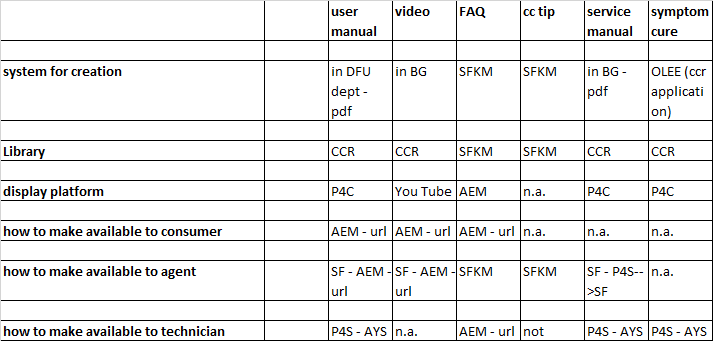

# FYP

## Meeting

Reinier Gratama - Director Consumer Care BG Coffee  
date: 2019-02-07

## Meeting minutes 

Discussed the applications

 1. Salesforce
 2. AYS
 3. FYP

### Salesforce

First point of contact with consumers/retailers.

Needs information on product CTN/12nc in order to log calls and find product information.

Current issue; not all products are known in Salesforce, although these are shown on the website. 
A possible cause is that these products are maintained in STEP/other applications and the feed from this application to Salesforce does not yet exist.

This issue is known with Patrick van Nuland.

Example: [Sleep /respiratory care products](https://www.philips.co.uk/healthcare/solutions/sleep-and-respiratory-care).

 - [HC1043941](https://www.philips.co.uk/healthcare/product/HC1043941/alice-pdx-portable-sleep-diagnostic-system) : not in Salesforce/CCR/FYP/Pikachu.
 - [HC1133430](https://www.philips.co.uk/healthcare/product/HC1133430/dreamwear-full-face-cushion-under-the-nose-full-face-cushion) : not in Salesforce/CCR/FYP/Pikachu.

### AYS

Application that is mostly used by the service centers, not by the call centers.

*Note*: 

  1. search on both CTN and chassis number (chassis can possibly be ignored)
  2. FAQ's (OLEE based) in AYS can be ignored and need to be replaced by the more up-to-date FAQs from Salesforce. *This interface is not yet on the road-map*.

### FYP

Application that is used by service centers, call centers, product marketing, other. Accessible through VPN and when on the Philips local network.

Large user base:
- 200 contact centers, 200-300 users (order-of-magnitude estimate Reinier), via intern netwerk of VPN
- everyone in service uses the application regularly. Pm 300 service users. 

Important information: basically everything currently in FYP.

- product-accesoire relations
- predecessor/successor products
- FAQ's  
  *Note*: CCR/FYP OLEE-based FAQ's have been migrated into Salesforce. **TODO**; check completeness.
  CCR/FYP OLEE-based FAQ'sare beeing phased out.
  *Note*: there are two types of FAQ's, with different doctypes. One for Services, the other for the Call-centers.

### Information sources

  

Abreviations: 

- AEM = consumer website
- DFU = 
-	SF = Salesforce
-	SFKM = Salesforce knowledge management
- P4C = care website
- P4S = service website
- AYS = At Your Service

## Other contacts

Janne van Herpt - expert in knowledge management systemen Support (salesforce knowledge management)

Udo Jungbluth = technical support person, responsible for the service center documentation maintenance and publication.

Nico Minaerts - PO Service

